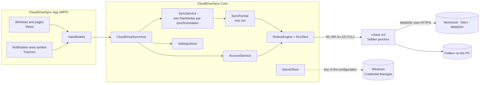
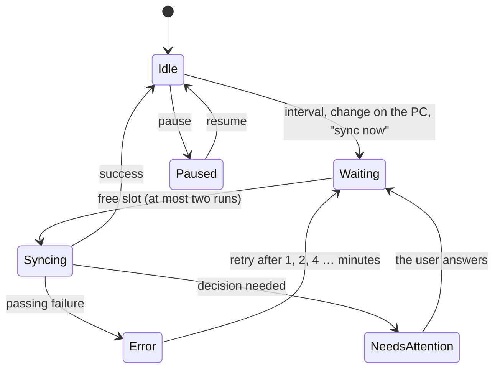
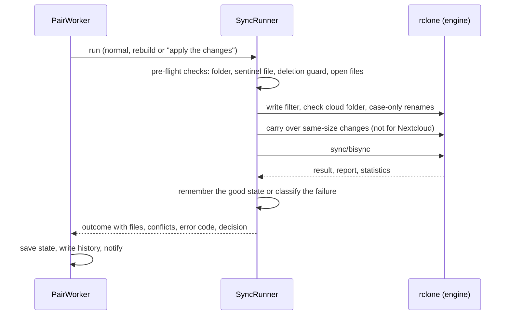

# Architecture of CloudDrive-Sync

*Deutsche Fassung: [ARCHITECTURE.md](ARCHITECTURE.md)*

This document explains how CloudDrive-Sync is built and why: its building blocks, the path of a synchronisation, the
safety mechanisms, and the quirks of rclone and the servers you need to know. How to build, test and publish the
project is in the [developer handbook](DEVELOPMENT.en.md); the rules for new code are in
[CONTRIBUTING.en.md](../CONTRIBUTING.en.md).

The user interface and user documentation are German; German terms in quotes ("Aktivität", "Abgleich überprüfen") are
names the user sees.

## Overview

CloudDrive-Sync keeps folders on a Windows PC in step with Nextcloud, IServ and other WebDAV storage, in both
directions. The actual work with the servers is done by [rclone](https://rclone.org) - more precisely `rclone bisync` -
in a hidden background process. CloudDrive-Sync controls it, wraps it in a safety net and shows everything in a
Windows 11 style interface.

## Projects and folders

| Folder | Content |
|---|---|
| `src/CloudDriveSync.Core` | All the logic: accounts, engine, synchronisation, settings, errors. Knows no user interface. |
| `src/CloudDriveSync.App` | The WPF interface (MVVM): windows, pages, notification area symbol, updates. |
| `tests/CloudDriveSync.Core.Tests` | Unit tests without network and without rclone (xUnit). |
| `tests/CloudDriveSync.Core.IntegrationTests` | Real rclone against a local WebDAV test server: file operations, safety mechanisms, the service. |
| `tools/` | Release (`New-Release.ps1`), program icon (`New-AppIcon.ps1`), encoding of source files (`Format-SourceFiles.ps1`). |

**Dependencies point one way only:** App → Core. The core uses no WPF; the tests put it together exactly like the
program does, through `CloudDriveSyncHost`.

Folders of the core:

| Folder | Responsibility |
|---|---|
| `Accounts` | Connecting and checking accounts, Nextcloud browser sign-in, WebDAV addresses, IServ folder names. |
| `Engine` | Providing rclone (`RcloneInstaller`), starting and stopping it (`RcloneEngine`), its RC API (`RcClient`), reading file data for files on demand (`FileServer`). |
| `Sync` | Managing synchronisations (`SyncService`), carrying out one run (`SyncRunner`) and all safety building blocks. |
| `CloudFiles` | Windows' Cloud Files API: registering folders (`SyncRoots`), placeholders (`Placeholders`), delivering data on opening (`SyncRootConnection`, `FetchRequest`). |
| `OnDemand` | The sync core for files on demand (under construction): state (`ItemStore`, `ItemIdentity`), names like rclone's (`NameEncoding`). |
| `Settings` | Data model (`AppSettings`) and saving it safely as JSON (`SettingsStore`). |
| `Security` | The key of the rclone configuration in the Windows Credential Manager (`SecretStore`). |
| `Errors` | Error codes `CD-xxxx` with title and fix in German and English (`ErrorCatalog`). |
| `Diagnostics` | The log (`Log`); secrets are redacted before anything is written. |

Folders of the app: `Infrastructure` (Windows integration: notification area symbol, autostart, updates, one instance
per user …), `ViewModels`, `Views` with `Views/Pages` (one file per page of the main window), `Themes/Styles.xaml`
(shared styles), `Assets` (program icon).

## Start-up

1. `Program.Main` lets [Velopack](https://velopack.io) speak first: while installing, updating and uninstalling,
   Velopack runs the program briefly with arguments of its own and ends it again.
2. `App.OnStartup` makes sure only one CloudDrive-Sync runs per user and data folder (`SingleInstance`): a second start
   asks the first one to show its window and ends.
3. The installed program records itself under "App Paths" (`AppRegistration`), so CloudDrives can find it.
4. `CloudDriveSyncHost` puts everything together: paths, log, settings, secrets, engine, accounts, synchronisations.
5. User interface: `MainViewModel`, notification area symbol, main window. With `--background` (start with Windows) the
   window stays closed.
6. `StartAsync` starts the engine and then every synchronisation.

Closing the window only hides it; CloudDrive-Sync keeps synchronising from the notification area. Only "Beenden"
(exit) stops all synchronisations cleanly and ends the engine.

## Data folder

Everything lives below one folder, by default `%LOCALAPPDATA%\CloudDrive-Sync` - separate from CloudDrives. The
environment variable `CLOUDDRIVE_SYNC_HOME` chooses another one (tests, portable copy). The installed program itself
lives elsewhere: `%LOCALAPPDATA%\CloudDriveSync\current` (Velopack).

| Path | Content |
|---|---|
| `settings.json` (+ `.bak`) | Accounts, synchronisations, preferences - **never a secret**. Saved through a temporary file with a backup; when the file is damaged, `SettingsStore` takes the backup. |
| `rclone.conf` | The rclone configuration with the sign-ins. **Always encrypted** (`RCLONE_ENCRYPT_V0:`). |
| `logs\` | `clouddrive-sync-<date>.log` (14 days), `rclone.log` (10 MB × 5). |
| `deps\rclone\1.75.1\` | `rclone.exe` in the pinned version. |
| `cache\` | rclone's cache. |
| `sync\<id>\` | State of one synchronisation, see below. |
| `cleanup.json` | Only when needed: folders in which placeholders stayed behind when a synchronisation with files on demand ended, with the registration they belong to (see "Ending" under "Files on demand"). |

In the synchronised folder itself, CloudDrive-Sync creates only two hidden things: the **sentinel file**
`.clouddrive-sync` and the **recycle bin** `.clouddrive-papierkorb\<date time>\`.

## Security of sign-ins

- Sign-in details are only entered when connecting. The password (for Nextcloud an app password of its own from the
  browser sign-in) stays in memory only until rclone takes it over.
- rclone keeps it in `rclone.conf`, which is always encrypted. The key lives in the Windows Credential Manager
  (`SecretStore`), protected by DPAPI for the signed-in user.
- `settings.json`, the log and the reports contain no secrets; `Log.Redact` blanks out passwords, tokens and `Bearer`
  values before writing.
- Another data folder gets entries of its own in the Credential Manager (`AppPaths.SecretPrefix`), so tests never touch
  the keys of the real installation.
- "Neu anmelden" (sign in again) first tries the new sign-in on a temporary remote (`cd-signin-<id>`); only when the
  server accepts it does it replace the old one.

## The engine

`RcloneEngine` starts exactly one hidden `rclone rcd` process and talks to it through the RC API (`RcClient`):

- only on `127.0.0.1`, with a random port and random credentials on every start (as environment variables, never on
  the command line),
- with the encrypted configuration (`RCLONE_CONFIG_PASS` from the Credential Manager),
- inside a Windows job object: when CloudDrive-Sync ends - even by a crash - the engine ends with it.

`RcloneInstaller` provides rclone in the pinned version 1.75.1: from the data folder, from `CLOUDDRIVE_SYNC_RCLONE`
(development, tests) or downloaded from rclone.org or GitHub - **accepted only when the SHA256 checksum matches**.

Every account is an rclone remote named `cd-<id>` (type WebDAV, with vendor nextcloud or other).

## A synchronisation

A synchronisation (`SyncPairSettings`) connects a cloud folder (`RemotePath`, empty = the whole account) with a folder
on the PC (`LocalPath`). It also has the selection (everything or only chosen folders and files), the conflict rule, the
interval, the deletion limit, `CloudCheckFile` (whether the sentinel file is in the cloud as well) and `LocalOnly`
(files the server did not take). In rclone's terms the cloud is **Path1**, the PC **Path2**.

Its state lives in `sync\<id>\`:

| File | Purpose |
|---|---|
| `filter.txt`, `filter.txt.md5`, `filter-base.txt` | The selection as an rclone filter (`SyncFilters`); the checksum belongs to bisync, the base file tells real selection changes from "PC only" files. |
| `bisync\` | bisync's work folder: the listings of both sides after the last run. |
| `last-good\` | A copy of these listings after the last good run (`RunSafety`). |
| `local-files.txt` | Every file on the PC with size and time after the last run (`DeleteGuard`). |
| `server-times.json` | Size and server time of every file on both sides (`QuietServerChanges`). |
| `state.json` | What survives a restart: first sync done, last run, open error, open decision. |
| `runs.jsonl` | The latest runs with the files they changed (`RunHistory`, for "Aktivität"). |
| `last-run.txt` | bisync's redacted report of the last run, for troubleshooting. |
| `items.db` | Files on demand only: every file and folder with the version of both sides after the last run (`ItemStore`, SQLite), plus since when the data of a file is on the PC (`on_disk`, for freeing space automatically). Instead of `bisync\`, `last-good\`, `local-files.txt` and `server-times.json`. |

### Who starts a run, and when

`SyncService` manages all synchronisations: adding (with sentinel files), ending (with the question what stays on the
PC, see "Ending and removing an account"), pausing, changing settings, answering decisions, "Abgleich überprüfen" (verify). Every synchronisation has a
**`PairWorker`** of its own (`SyncService.PairWorker.cs`):

- An **interval timer** fetches changes from the cloud (default: every 5 minutes).
- A **folder watcher** (`FileSystemWatcher`) notices changes on the PC; after 5 seconds of quiet a run starts. Temporary
  files of Office and LibreOffice do not count.
- **Retries:** a file held open by another program is tried again every minute, network or server trouble after 1, 2,
  4 … minutes, at most the interval.
- Requests that arrive during a run are merged; the strongest wins (rebuild over "apply the changes" over a normal run).
- At most **two runs at the same time** across all synchronisations. "Abgleich überprüfen" waits until a running sync
  of the same synchronisation has finished.
- When a synchronisation needs a **decision** (too many deletions, rebuild, sign-in, missing folder), no automatic runs
  happen until the user answers.

### One run

`SyncRunner` carries out one run. The order is deliberate: first it checks whether a run can be safe at all, then
rclone synchronises, then the outcome is evaluated.

1. **Pre-flight checks** - without network, before anything changes:
   - Without the folder on the PC (e.g. a USB stick pulled out) nothing runs: an empty folder is never taken as
     "everything deleted" (`CD-4501`).
   - Without the sentinel file the synchronisation stops (`CD-4503`).
   - **Deletion guard** (`DeleteGuard`): when more files are missing on the PC than allowed, it stops before anything is
     deleted in the cloud (`CD-4502`).
   - When a changed file is held exclusively by another program, the run waits (`CD-4510`) instead of rclone giving up
     the whole run.
2. **Preparation:** write the filter file. Without a sentinel file in the cloud, `CloudFolderCheck` makes sure the cloud
   folder is there and does not suddenly look empty (`CD-4512`). `CaseRenames` carries over renames that only change
   upper and lower case.
3. **Same-size changes** (`QuietServerChanges`, not for Nextcloud): servers without modification times of their own do
   not reveal a change that keeps the size. CloudDrive-Sync therefore remembers size and server time of every file and
   carries such changes over itself - in both directions, as a conflict copy when both sides changed.
4. **bisync** with the settings of `BisyncCommand` (see below).
5. **Evaluation:**
   - Success: the deletion guard's list, the server times and the good state (`last-good`) are remembered; `RunChanges`
     reads from the report which file went where. `PcListingTimes` puts the real file times into bisync's listing of the
     PC side where bisync noted the server's time (see quirks).
   - When the server refuses single files (e.g. a read-only folder), they stay on the PC and out of the synchronisation
     (`LocalOnly`); the run is repeated without them - without a rebuild.
   - Names that differ only in upper and lower case: the PC takes the server's spelling and the run is repeated once.
   - When a run breaks off on something that passes (a file in use, the network gone), `RunSafety` restores the last
     good state and the next try comes soon - without a rebuild.
   - Everything else is mapped to an error code by `ErrorCatalog.Classify`; some codes ask the user for a decision.

### bisync settings

| Setting | Why |
|---|---|
| `checkAccess` + `checkFilename .clouddrive-sync` | A sentinel file on both sides: when a folder is gone or moved, bisync stops instead of deleting everything. |
| `maxDelete` = the synchronisation's deletion limit | More deletions than allowed stop the run (in addition to `DeleteGuard`). |
| `compare = size,modtime,checksum`, `slowHashSyncOnly` | Each side compares with what it supports; checksums on the PC only where needed. |
| `conflictResolve`, `conflictLoser = num`, `conflictSuffix` | Conflicts follow the chosen rule; the other version stays as `Name.Konflikt-PC1.docx` or `Konflikt-Cloud1`. |
| `recover`, `resilient`, `maxLock = 30m` | Continue cleanly after an interruption; retry less serious errors at the next run. |
| `backupDir2` | What the synchronisation deletes or replaces on the PC goes to the recycle bin on the PC. |
| `TrackRenames`, `SuffixKeepExtension` | Renamed files are not uploaded again; conflict copies keep their extension. |
| `resync` + `resyncMode = newer` (first sync and rebuild only) | Merge both sides, **delete nothing**. |
| `force` (only after confirmation) | Apply deletions above the limit when the user explicitly wants it. |

While bisync reads both sides, rclone counts the entries read (`listed` in `core/stats`, `JobProgress.Listed`); the card
shows them ("Liest Cloud und PC: 12.345 Einträge …"), so a large first run does not look stuck.

### Ending and removing an account

When a synchronisation ends or an account is removed, a window (`EndSyncViewModel`) asks what stays on the PC
(`KeepOnPc`, `SyncService.Removal.cs`). Nothing ever changes in the cloud.

| Choice | What happens |
|---|---|
| Keep fetched files (default) | A classic folder stays as it is. With files on demand, files with their data on the PC become normal files; online-only files leave the PC. |
| Fetch and keep everything (files on demand only) | A last run, then the space check (`CD-4606`) and every online-only file is fetched; then as above - a complete copy stays. |
| Delete from the PC | A last run must succeed, otherwise the synchronisation stays (`CD-4608`). Then the files provably in the cloud go into Windows' recycle bin (`RecycleBin`) - with files on demand the placeholders in sync, classic the files still exactly as bisync's listing noted them for the PC - together with the folder's own recycle bin (`.clouddrive-papierkorb`). Empty folders go, the folder itself last. |

Whatever stays - files only on this PC such as Office's lock files, files changed just then, files a program holds - the
window names and asks about; only on "In den Papierkorb" does `RecycleRestAsync` move them to the recycle bin, too, and
remove the folder. Never a folder another synchronisation uses, or one above or inside it. The recycle bin is filled
with `SHFileOperation` and undo; when a file is too large for it, Windows asks first instead of deleting it for good
silently.

## Key decisions

- **rclone bisync instead of a sync engine of our own.** bisync is proven, knows WebDAV, Nextcloud and many other
  storage systems, and works traceably with listings of both sides. CloudDrive-Sync wraps a safety net around it instead
  of reinventing synchronisation. For files on demand (version 0.3, Windows Cloud Files API) a core of its own is
  being built, see [below](#files-on-demand-from-version-03-under-construction).
- **A deletion guard of its own, counted in files.** rclone's limit counts folders as well; in small folder trees it
  triggers too late or too early. `DeleteGuard` counts files, the way people read "more than half".
- **A sentinel file on both sides** - and where the server takes no file (IServ: "Gruppen" itself, the whole account,
  read-only folders), `CloudFolderCheck` checks the cloud folder itself before every run.
- **Server times of its own** (`QuietServerChanges`) for servers without reliable modification times, so same-size
  changes are not lost.
- **The last good state** (`RunSafety`): passing problems no longer cost a rebuild.
- **Refused files stay on the PC** (`LocalOnly`) instead of forcing a rebuild; the checksum of the filter file is renewed
  deliberately for that.
- **Recycle bin on the PC only.** A recycle bin folder in the cloud would be visible on the server - in shared folders to
  everybody. What is deleted on the PC is in the Windows recycle bin anyway; Nextcloud has one of its own.
- **Secrets only encrypted** in the rclone configuration, the key in the Windows Credential Manager - never in settings,
  logs or this repository.
- **One engine** on `127.0.0.1` with a random port and random credentials, bound to CloudDrive-Sync (job object).
- **Velopack** for installation and updates: per user without administrator rights, .NET included, updates only from the
  GitHub project and checked against their checksum.
- **Separate from CloudDrives:** own data folder, own keys, own program. Each opens the other from its notification area
  symbol, but neither depends on the other.

## Quirks of rclone and the servers

- **Filter changes:** bisync remembers the checksum of the filter file (`filter.txt.md5`) and insists on a rebuild after
  any change. A changed selection therefore deliberately triggers a rebuild. Only when nothing but the "PC only" files
  change does `SyncFilters.Write` renew the checksum itself - recognised by `filter-base.txt`.
- **Times of the PC side:** when a file lies on both sides with the same size and the server's time is newer, bisync
  notes that time for the PC as well - without carrying it over, because IServ lets no times be set and rclone compares
  only sizes there. At the next run the PC file would look "older": bisync would upload it again, possibly over a newer
  version on the server, and stop with "all files were changed" when that concerns every file - the protection file
  included, which the server receives a moment after the PC wrote it. This happens after the first synchronisation of a
  folder whose files were on both sides already. `PcListingTimes` corrects such entries after every successful run:
  only entries with the server's time, the file's size and a time newer than the file - a change on the PC makes a file
  newer, never older.
- **"must resync":** after some failures bisync insists on a rebuild. With `last-good` and `resilient`/`recover`,
  CloudDrive-Sync gets by without one for passing failures.
- **bisync's report** is the source of which file went where (`RunChanges`): `Queue copy to Path1` (uploaded),
  `Queue copy to Path2` (fetched), `Queue delete`, during a rebuild `Resync is copying files to`.
- **IServ** keeps no modification times of its own (rclone compares sizes only there) and takes no files in its root and
  in "Groups" itself (answer 500). In WebDAV its folders are called `Files` and `Groups`, on its web pages "Eigene
  Dateien" and "Gruppen" - CloudDrive-Sync shows the familiar names (`CloudFolderNames`).
- **Nextcloud** has modification times and checksums and answers refused writes with 403. `rclone serve webdav` cannot
  emulate Nextcloud; testing it needs a real account.
- **Upper and lower case:** Windows takes `Bericht.docx` and `bericht.docx` for the same file, the servers for two.
  bisync then stops with "out of sync"; `CaseRenames` aligns the spellings beforehand.
- **rclone's deletion limit** counts folders as well (see above).

## Files on demand (from version 0.3, under construction)

With files on demand, all files of a synchronisation appear in Explorer at once but take up space only when they are
opened or "Always keep on this device" is chosen - as with OneDrive. For this CloudDrive-Sync gets a sync core of its
own on Windows' **Cloud Files API** (the filter driver `cldflt.sys` with the Win32 interface `cfapi.h`, and
`Windows.Storage.Provider` for the registration). Classic synchronisations keep running with bisync.

A prototype checked beforehand, in a real Windows 11 session, what the core builds on:

| Question | Result |
|---|---|
| Registration without an app package | Works from .NET 10 through `StorageProviderSyncRootManager`. Windows itself adds the entry in the navigation pane (CLSID and `Desktop\NameSpace` in HKCU) and removes it again on unregistering. |
| Placeholders | `CfCreatePlaceholders` creates 10,000 placeholders in 1.3 s. They show size and time and take 0 bytes. |
| Data on opening | Through `serve/start type=http` in the engine with HTTP range requests, in blocks of 1 MB: 100 MB in 0.6 s, 2 GB in 7.7 s. Umlauts and spaces in the path are no problem. |
| Time limit of 60 s | Windows gives every request 60 s; every data transfer resets the clock: 80 MB at 1 MB/s (81 s) arrived complete. |
| Cancelling | Windows sends `CANCEL_FETCH_DATA`. Parts already fetched stay; the rest comes at the next opening. |
| Program ended or crashed | Opening an online file reports "The cloud file provider exited unexpectedly"; fetched files stay readable. A transfer running during the crash is discarded by Windows. After a restart everything continues. |
| Reading by itself | With `CF_CONNECT_FLAG_BLOCK_SELF_IMPLICIT_HYDRATION`, CloudDrive-Sync reading an online file by accident fails ("access denied"). Fetching on purpose with `CfHydratePlaceholder` works. |
| Pinning | "Always keep" (like `attrib +P`) only sets the state, on a folder only on the folder - the core has to fetch. New placeholders in pinned folders take the state over with `CF_PIN_STATE_INHERIT`. |
| Change on the PC | Writing to a fetched file marks it "not in sync". Saving like Word (new file, rename) and with `ReplaceFile` leaves a normal file at the same path. |
| Change in the cloud | When the size changes in the cloud, the core refuses to fetch; after `CfUpdatePlaceholder` with `DEHYDRATE` the new version arrives. |
| Switching over | A folder of normal files becomes a sync root without any transfer (`CfConvertToPlaceholder`): 2,000 files in 0.8 s, all "in sync" and present. |
| Nesting | Windows refuses a sync root inside another one. `CfGetSyncRootInfoByPath` tells whether a folder belongs to a cloud program already. |
| Unregistering | 12,000 entries in 3.8 s. Fetched files become normal files, online-only placeholders vanish from the PC. That fits into the 30 s Velopack allows while uninstalling. |
| Queries | `GetCurrentSyncRoots` and `GetSyncRootInformationForId` leave out sync roots in the temp folder. Tests (whose folders lie there) therefore find their sync roots through the registry. |
| WinRT without a third-party library | Microsoft's projection of the Windows SDK (`Microsoft.Windows.SDK.NET.dll`, 24 MB) is not under an open-source licence. CloudDrive-Sync needs only `Register` and `Unregister` of it and calls both directly through COM (`WinRtSyncRootManager`); the target stays `net10.0-windows`, the code for Windows 10 carries `[SupportedOSPlatform("windows10.0.17763")]`. The state is stored by Windows' own SQLite (`winsqlite3`); no native library ships. |
| Fallback | `core/command` with `cat` and `STREAM_ONLY_STDOUT` delivers data as well, but starts an rclone process of its own per request (the engine's bandwidth limit does not apply there) and appends `{}` and a line break to the data. It stays the fallback. |

Rules for the core that follow from this:

- **Only the version the placeholder stands for is fetched** (size and time, with Nextcloud also the checksum). If the
  cloud differs, fetching fails and a run updates the placeholder; `DEHYDRATE` also discards parts of an old version.
  So a file never consists of two versions.
- **Only what is in sync is freed.** A file changed on the PC and not uploaded yet keeps its content, even when someone
  chooses "Free up space".
- **A normal file at the path of a placeholder is a change**, not a deletion plus a new file - that is how Office and
  many other programs save.
- **A pinned folder** passes its state on to everything in it (`CfSetPinState` with `RECURSE`), and the core fetches it.
- **Placeholders are named like rclone names files:** `NameEncoding` translates names the way rclone's local backend
  writes them on Windows ("Was?.docx" becomes "Was？.docx"). So a folder bisync filled matches after switching over.

### How the core works

A synchronisation with `Mode = OnDemand` goes through the same `PairWorker` as a classic one - interval, folder watcher,
retries, decisions and history are the same. Only the run itself differs (`SyncService.OnDemand.cs`):

| Building block | Task |
|---|---|
| `OnDemandPair` | The live parts of a synchronisation: state (`ItemStore` in `sync\<id>\items.db`), registration with Windows, connection. It connects as soon as the program starts, so files open right after signing in. |
| `OnDemandRunner` | One run: check folder and protection file, register and connect, read both sides, plan, deletion guard, carry out. The result is a `SyncRunOutcome` as with bisync. |
| `Listings` | rclone reads both sides with the same filter file (`SyncFilters`) - selection, exclusions and files that stay on the PC apply as in classic mode. Plus, for every file on the PC, what Windows knows about its placeholder. Only metadata is read. The cloud side is read folder by folder, eight at once (see below). |
| `Planner` | A pure function of the remembered state, the cloud and the PC: the plan of all steps, before anything changes. |
| `Executor` | Carries the plan out and records every finished step in the `ItemStore` at once. |
| `CloudFetcher` | Delivers the data when a program opens a file. |
| `PinWatcher` | Carries out "Always keep on this device" and "Free up space". Explorer only sets the pin state of the chosen entry; the watcher fetches or frees and passes a folder's state on to everything in it. |

**The planner's rules** (a three-way comparison - a side counts as changed when it differs from the common state):

- When both sides changed, both versions are kept - by the synchronisation's conflict rule, with the same names as with
  bisync (`Name.Konflikt-PC1.ext`, `Name.Konflikt-Cloud1.ext`). On servers without times of their own, "the newer one
  wins" becomes "keep both". When the server has a checksum and the content is the same, no copy is made.
- A change beats a deletion: changed in the cloud and deleted on the PC (or the other way round) brings the file back.
- The first run and a rebuild delete nothing; files of the same size count as the same (as with bisync on servers without
  checksums), otherwise both stay.
- A normal file in the place of a placeholder is a change (that is how Office saves). A placeholder in a new place was
  renamed or moved - it is moved in the cloud, not uploaded again; a folder takes its content along. While a file's
  placeholder lies anywhere on the PC, the file never counts as "deleted on the PC".
- Deletions are counted in files; more than the deletion limit stops the run (`CD-4502`), as before.

**The executor** works in this order: moves, new folders, adoptions, uploads, conflicts, new placeholders, refreshed
placeholders, deletions (files before their folders, which go only when empty). Before every change it looks again: it
uploads and deletes in the cloud only while the cloud still has the known version, and deletes on the PC only an
unchanged file. Whatever changed meanwhile is left for the next run. For uploads it sets `IgnoreTimes`, because on
servers without times of their own rclone would skip a change of the same size. `Placeholders.FinishUpload` marks a file
in sync only while it is still exactly the uploaded version - checking, converting and marking happen while a lock keeps
every writer out. Files whose data was on the PC and which the cloud deleted go into the recycle bin as normal files.

**The CloudFetcher** delivers only the version a placeholder stands for: before the first byte the server's size must
match, before the last piece size, time and - where available - checksum. Otherwise opening fails cleanly ("The cloud
operation was unsuccessful") and a run follows at once. The data comes through `FileServer` (`rclone serve http` in the
engine) in pieces of 1 MB; each resets Windows' 60-second clock.

**The cloud listing** reads every folder on its own, eight at once. rclone's recursive listing ends at the first folder
the server refuses (say "403 Forbidden" for a Nextcloud share to upload only) and does not name it. Here such a folder
stays out of the run with everything in it: nothing there counts as deleted, nothing is created or uploaded there, and
the log names it. Only a missing connection, sign-in or engine ends the run, as everywhere. rclone's WebDAV backend waits
at least 10 ms between two requests - at most 100 folders a second, however fast the server. For listing, CloudDrive-Sync
sets the pause to 1 ms (`pacer_min_sleep` in the remote string; not 0, because rclone doubles it after "too many
requests"). Measured with 10,525 entries in 526 folders on the test server: 1.2 s instead of 5.4 s. Every run writes the
times of both listings to the log. The same reading (`CloudWalker`) counts in the assistant's last step what the
synchronisation covers and reports folders, files and size as it goes; the card of a running synchronisation shows as
well how far the reading got.

**Status in Explorer:** Windows takes the state "in sync" from folders (the root never has it at first), and Explorer
shows no symbol for such folders ("sync pending"). After every run `Executor.MarkFoldersInSync` therefore marks all
folders in sync - except the way to something left for the next run and the unreadable folders. The state of the whole
synchronisation goes to Windows through `SyncRootConnection.Report` (idle, syncing, offline, error). It is checked with
Explorer's own columns "Availability status" and "Status" through `Shell.Application` - where Explorer's commands
"Always keep on this device" and "Free up space" can be carried out, too, without a screen.

**Keeping and freeing:** only a file in sync is freed - a change not uploaded yet is never lost that way; the run after
the upload frees the space. New placeholders in a pinned folder are pinned themselves and fetched at once, in new
subfolders, too. What the watcher misses (say, because CloudDrive-Sync was not running) every run catches up with
(`Executor.ApplyPinStates`): a file without a state of its own takes that of the nearest folder above it that has one.

**Freeing space automatically** (Einstellungen › "Speicherplatz automatisch freigeben", default "Nie"): after every run
`Executor.FreeUpSpace` gives back the space of files not used for a while. The rule is `Planner.ShouldFree`: data on the
PC, in sync, no pin state of its own, and neither opened nor changed nor fetched within the chosen number of days.
"Opened" is NTFS' last access time, "fetched" the moment CloudDrive-Sync first saw the data on the PC (`on_disk`). It
protects a file fetched just now and stands in where Windows keeps no last access time. The same pass measures what lies
on the PC; the card shows it ("1,2 GB von 18 GB auf diesem PC", `SpaceUse` in `state.json`).

**Registration lost:** when the folder is no longer registered with Windows after the first run, Windows has removed the
online-only placeholders from the PC. A normal run would take them as "deleted on the PC". `OnDemandPair` registers the
folder again and records that in the state (`items.db`, so it survives a crash); the next run then merges both sides
like a rebuild and deletes nothing - even when "apply deletions" was chosen before.

**Ending** (see "Ending and removing an account") dissolves the placeholders *before* the registration ends
(`Leftovers.Dissolve`): an online-only placeholder in sync leaves the PC, a file with its data on the PC or with a change
not uploaded yet becomes a normal file (`CfRevertPlaceholder`), a placeholder folder likewise, or it goes when empty.
Only then does the registration end. The reason: a placeholder left after unregistering - because a program such as
Explorer or the search index held it open just then - belongs to a registration that no longer exists. Windows calls
it damaged (error 363), nothing can open or delete it, and Explorer cannot even delete the folder. Therefore:
- After unregistering, `EndOnDemand` waits up to 60 s until the folder is clear (`Leftovers.WaitUntilClear`).
- Should something stay, `cleanup.json` notes folder and registration. At the next start (and the next ending)
  `FinishCleanUps` registers exactly that registration at that folder again for a moment - only then can Windows read
  the placeholders again -, dissolves them and unregisters. A registration a synchronisation uses, or one pointing to
  another folder by now, is never touched; the entry waits until that synchronisation ends.
- Every new synchronisation with files on demand and every switch gets a registration of its own (`RegistrationKey`,
  "&lt;synchronisation&gt;-&lt;8 characters&gt;"), so remains of an earlier one never fit a new one. `ConnectNew` does not
  register a folder with remains at all (`CD-4602`).

When uninstalling, the Velopack hook unregisters all of the program's folders (`SyncRoots.UnregisterAll`, 12 000 entries
in less than 4 s); should CloudDrive-Sync come back, the rule "registration lost" applies.

**Switching** (`SyncService.Conversion.cs`, in the window "Einstellungen der Synchronisation"):
- **Classic → files on demand:**
  - First a normal bisync run; should it fail, everything stays as it was (`CD-4607`).
  - Then `PcListingTimes.ReadRecord` reads bisync's listings of both sides. `OnDemandRunner.InStep` takes only files
    that still have, on the PC *and* in the cloud, the size and time bisync noted (to the second).
  - Only these count as the same without a checksum in the first run (`Planner.Input.InStep`) and become placeholders
    without any transfer; any other file on both sides is kept in both versions.
  - Should the switch break off, `BackToClassic` unregisters the folder again - all files were on the PC and stay as
    normal files - and bisync goes on as before.
  - When it succeeds, bisync's working files go (`bisync\`, `last-good\`, `local-files.txt`, `server-times.json`).
- **Files on demand → classic:**
  - A run uploads changes on the PC first.
  - Then the drive needs room for all online files, with a reserve (1 GB or a twentieth; otherwise `CD-4606`). All are
    fetched, the folder is unregistered (the files stay), and `ResyncPending` in `state.json` makes the first classic
    run merge - also after a restart.

**Changing the selection:** an item neither listing contains any more is forgotten (`Forget`). When its placeholder
still lies on the PC, it was deselected: data on the PC → normal file (`CfRevertPlaceholder`), online only → gone from
the PC (it stays in the cloud), and an empty folder goes, too. Selected again, the rebuild merges.

**"Abgleich überprüfen"** (`OnDemandVerifier`) fetches nothing: it compares online files by name and size from the
listings; for files on the PC, rclone's `operations/check` gets exactly these as `FilesFrom` and so touches no online
file. A change not uploaded yet counts as a difference.

**In Explorer:**
- The name in the navigation pane is chosen in the settings; default "&lt;account&gt; – &lt;folder&gt;"
  (`SyncService.ExplorerNameOf`). With files on demand, Windows takes a registration with the same ID as an update,
  also while the folder is connected (`OnDemandPair.Rename`).
- Classic synchronisations get an entry of the same kind (`ExplorerEntries`, per user in HKCU). The CLSID follows from
  the synchronisation and the data folder, a marker value tells the entries of CloudDrive-Sync from all others, and
  only those are ever removed. They are refreshed at the start, left-overs removed, and all of them go when
  uninstalling.
- `OnDemandProblem` also rules out folders that have a sync root *inside* them (`SyncRoots.RegisteredFolders`, from
  every registration's `UserSyncRoots`; Windows nests no sync roots).

**Restart after a crash:** the installed version registers with `RegisterApplicationRestart("--background")` - online
files open only while CloudDrive-Sync runs. Not after a restart of Windows: the start entry does that.

## Error codes

Every error has a code `CD-xxxx` with title and fix in German and English (`ErrorCatalog`). The numbers follow the same
ranges as in CloudDrives:

| Range | Topic |
|---|---|
| `CD-1xxx` | Downloads and checksums (e.g. rclone) |
| `CD-2xxx` | Settings, configuration, keys |
| `CD-3xxx` | Sign-in and servers |
| `CD-45xx` | Synchronisation (folder, deletion guard, rebuild, files in use …) |
| `CD-46xx` | Files on demand (folder, registration with Windows, fetching, switching) |
| `CD-5xxx` | Connection and engine |
| `CD-9000` | Unexpected error |

`ErrorCatalog.Classify` recognises codes by patterns in the answers of rclone and the servers. Whether a code asks for
a decision is decided by `SyncRunner` (`SyncDecision`).

## The user interface

- **MVVM** with the [CommunityToolkit.Mvvm](https://learn.microsoft.com/dotnet/communitytoolkit/mvvm/): properties with
  `[ObservableProperty]`, commands with `[RelayCommand]`. Views hold no business logic, only window behaviour (e.g. the
  folder picker).
- `MainViewModel` holds the pages (`Page`), the cards of the synchronisations (`SyncPairViewModel`) and accounts
  (`AccountViewModel`), the activity and the updates. Every page of the main window lives in `Views/Pages`.
- **Threads:** `SyncService` reports changes on any thread; `MainViewModel` hands them to the window thread
  (`OnWindowThread`).
- **Dialogs** go through `IDialogs`/`DialogService`, so view models know no windows.
- **Notification area symbol** (`TrayIcon`): status dot, menu, notifications.
- **Updates:** `UpdatesViewModel` with `Updater` (Velopack, GitHub releases; test versions are pre-releases).
- **Accessibility:** controls carry `AutomationProperties.Name`; lists of cards use `CardList`, so screen readers find
  their entries.
- **User interface texts** are German and live directly in XAML and the view models.
- **Pictures of its own windows** for tests: `CLOUDDRIVE_SYNC_SNAPSHOTS=<folder>` (`WindowSnapshots`).

## Logs and troubleshooting

- `logs\clouddrive-sync-<date>.log`: what CloudDrive-Sync does (time, level, component, text), redacted.
- `logs\rclone.log`: the engine's log.
- `sync\<id>\last-run.txt`: bisync's report of the last run.
- "Abgleich überprüfen" in the interface compares every file of both sides without changing anything (`SyncVerifier`).
