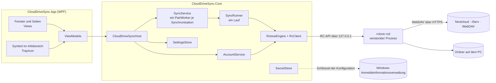
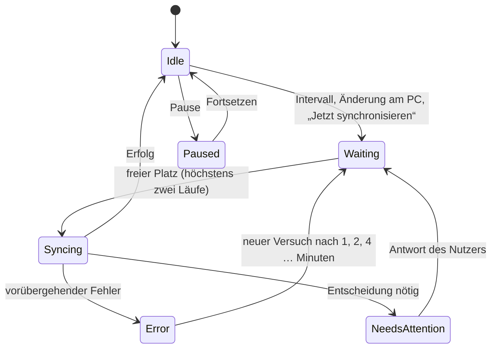
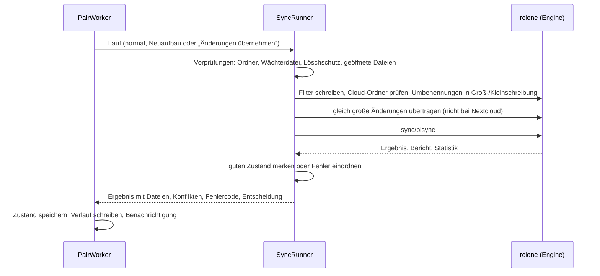

# Aufbau von CloudDrive-Sync

*English version: [ARCHITECTURE.en.md](ARCHITECTURE.en.md)*

Dieses Dokument erklärt, wie CloudDrive-Sync aufgebaut ist und warum: die Bausteine, den Weg einer Synchronisation,
die Schutzmechanismen und die Eigenheiten von rclone und den Servern, die man kennen muss. Wie man das Projekt baut,
testet und veröffentlicht, steht im [Entwickler-Handbuch](DEVELOPMENT.md), die Regeln für neuen Code in
[CONTRIBUTING.md](../CONTRIBUTING.md).

## Überblick

CloudDrive-Sync hält Ordner auf einem Windows-PC mit Nextcloud, IServ und anderen WebDAV-Speichern in beide Richtungen
aktuell. Die eigentliche Arbeit mit den Servern erledigt [rclone](https://rclone.org) – genauer `rclone bisync` – in
einem versteckten Hintergrundprozess. CloudDrive-Sync steuert ihn, legt ein Sicherheitsnetz um ihn und zeigt alles in
einer Windows-11-Oberfläche.

## Projekte und Ordner

| Ordner | Inhalt |
|---|---|
| `src/CloudDriveSync.Core` | Die ganze Fachlogik: Konten, Engine, Synchronisation, Einstellungen, Fehler. Kennt keine Oberfläche. |
| `src/CloudDriveSync.App` | Die WPF-Oberfläche (MVVM): Fenster, Seiten, Symbol im Infobereich, Updates. |
| `tests/CloudDriveSync.Core.Tests` | Unit-Tests ohne Netz und ohne rclone (xUnit). |
| `tests/CloudDriveSync.Core.IntegrationTests` | Echtes rclone gegen einen lokalen WebDAV-Testserver: Dateivorgänge, Schutzmechanismen, Dienst. |
| `tools/` | Release (`New-Release.ps1`), Programmsymbol (`New-AppIcon.ps1`), Kodierung der Quelldateien (`Format-SourceFiles.ps1`). |

**Abhängigkeiten zeigen nur in eine Richtung:** App → Core. Der Core benutzt kein WPF; die Tests setzen ihn genauso
zusammen wie das Programm, über `CloudDriveSyncHost`.

Ordner im Core:

| Ordner | Aufgabe |
|---|---|
| `Accounts` | Konten verbinden und prüfen, Nextcloud-Anmeldung im Browser, WebDAV-Adressen, Ordnernamen von IServ. |
| `Engine` | rclone bereitstellen (`RcloneInstaller`), starten und beenden (`RcloneEngine`), seine RC-API (`RcClient`), Dateidaten für „Dateien bei Bedarf“ lesen (`FileServer`). |
| `Sync` | Synchronisationen verwalten (`SyncService`), einen Lauf ausführen (`SyncRunner`) und alle Schutzbausteine. |
| `CloudFiles` | Die Cloud Files API von Windows: Ordner anmelden (`SyncRoots`), Platzhalter (`Placeholders`), Daten beim Öffnen liefern (`SyncRootConnection`, `FetchRequest`). |
| `OnDemand` | Der Sync-Kern für „Dateien bei Bedarf“ (im Aufbau): Zustand (`ItemStore`, `ItemIdentity`), Namen wie bei rclone (`NameEncoding`). |
| `Settings` | Datenmodell (`AppSettings`) und das sichere Speichern als JSON (`SettingsStore`). |
| `Security` | Der Schlüssel der rclone-Konfiguration in der Windows-Anmeldeinformationsverwaltung (`SecretStore`). |
| `Errors` | Fehlercodes `CD-xxxx` mit Titel und Lösung auf Deutsch und Englisch (`ErrorCatalog`). |
| `Diagnostics` | Das Protokoll (`Log`), Geheimnisse werden vor dem Schreiben geschwärzt. |

Ordner der App: `Infrastructure` (Windows-Anbindung: Symbol im Infobereich, Autostart, Updates, eine Instanz pro
Benutzer …), `ViewModels`, `Views` mit `Views/Pages` (je Seite des Hauptfensters eine Datei), `Themes/Styles.xaml`
(gemeinsame Stile), `Assets` (Programmsymbol).

## Der Start

1. `Program.Main` lässt zuerst [Velopack](https://velopack.io) zu Wort kommen: Beim Installieren, Aktualisieren und
   Deinstallieren startet Velopack das Programm kurz mit eigenen Argumenten und beendet es wieder.
2. `App.OnStartup` sorgt dafür, dass pro Benutzer und Datenordner nur ein CloudDrive-Sync läuft (`SingleInstance`): Ein
   zweiter Start bittet den ersten, sein Fenster zu zeigen, und endet.
3. Das installierte Programm trägt sich unter „App Paths“ ein (`AppRegistration`), damit CloudDrives es findet.
4. `CloudDriveSyncHost` setzt alles zusammen: Pfade, Protokoll, Einstellungen, Geheimnisse, Engine, Konten,
   Synchronisationen.
5. Oberfläche: `MainViewModel`, Symbol im Infobereich, Hauptfenster. Mit `--background` (Start mit Windows) bleibt das
   Fenster zu.
6. `StartAsync` startet die Engine und danach jede Synchronisation.

Schließt man das Fenster, wird es nur versteckt; CloudDrive-Sync synchronisiert im Infobereich weiter. Erst „Beenden“
hält alle Synchronisationen sauber an und beendet die Engine.

## Datenordner

Alles liegt unter einem Ordner, standardmäßig `%LOCALAPPDATA%\CloudDrive-Sync` – getrennt von CloudDrives. Die
Umgebungsvariable `CLOUDDRIVE_SYNC_HOME` wählt einen anderen (Tests, tragbare Kopie). Das installierte Programm selbst
liegt woanders: `%LOCALAPPDATA%\CloudDriveSync\current` (Velopack).

| Pfad | Inhalt |
|---|---|
| `settings.json` (+ `.bak`) | Konten, Synchronisationen, Einstellungen – **nie ein Geheimnis**. Gespeichert wird über eine temporäre Datei mit Sicherung; ist die Datei beschädigt, nimmt `SettingsStore` die Sicherung. |
| `rclone.conf` | Die rclone-Konfiguration mit den Zugängen. **Immer verschlüsselt** (`RCLONE_ENCRYPT_V0:`). |
| `logs\` | `clouddrive-sync-<Datum>.log` (14 Tage), `rclone.log` (10 MB × 5). |
| `deps\rclone\1.75.1\` | `rclone.exe` in der festgelegten Version. |
| `cache\` | Zwischenspeicher von rclone. |
| `sync\<id>\` | Zustand einer Synchronisation, siehe unten. |
| `cleanup.json` | Nur wenn nötig: Ordner, in denen beim Beenden einer Synchronisation „bei Bedarf“ Platzhalter übrig blieben, mit der Anmeldung, zu der sie gehören (siehe „Beenden“ unter „Dateien bei Bedarf“). |

Im synchronisierten Ordner selbst legt CloudDrive-Sync nur zwei versteckte Dinge an: die **Wächterdatei**
`.clouddrive-sync` und den **Papierkorb** `.clouddrive-papierkorb\<Datum Uhrzeit>\`.

## Sicherheit der Zugangsdaten

- Zugangsdaten werden nur beim Verbinden eingegeben. Das Passwort (bei Nextcloud ein eigenes App-Passwort aus der
  Anmeldung im Browser) bleibt nur im Speicher, bis rclone es übernimmt.
- rclone hält es in `rclone.conf`, die immer verschlüsselt ist. Der Schlüssel liegt in der
  Windows-Anmeldeinformationsverwaltung (`SecretStore`), geschützt durch DPAPI für den angemeldeten Benutzer.
- `settings.json`, das Protokoll und die Berichte enthalten keine Geheimnisse; `Log.Redact` schwärzt Passwörter,
  Tokens und `Bearer`-Angaben vor dem Schreiben.
- Ein anderer Datenordner bekommt eigene Einträge in der Anmeldeinformationsverwaltung (`AppPaths.SecretPrefix`), damit
  Tests nie die Schlüssel der echten Installation berühren.
- „Neu anmelden“ prüft die neue Anmeldung zuerst an einem vorübergehenden Remote (`cd-signin-<id>`); erst wenn der Server
  sie annimmt, ersetzt sie die alte.

## Die Engine

`RcloneEngine` startet genau einen versteckten Prozess `rclone rcd` und spricht mit ihm über die RC-API (`RcClient`):

- nur auf `127.0.0.1`, mit zufälligem Port und zufälligen Zugangsdaten bei jedem Start (als Umgebungsvariablen, nie auf
  der Befehlszeile),
- mit der verschlüsselten Konfiguration (`RCLONE_CONFIG_PASS` aus der Anmeldeinformationsverwaltung),
- in einem Windows-Job-Objekt: Endet CloudDrive-Sync – auch durch einen Absturz –, endet die Engine mit.

`RcloneInstaller` stellt rclone in der festgelegten Version 1.75.1 bereit: aus dem Datenordner, aus
`CLOUDDRIVE_SYNC_RCLONE` (Entwicklung, Tests) oder als Download von rclone.org bzw. GitHub – **nur angenommen, wenn die
SHA256-Prüfsumme stimmt**.

Jedes Konto ist in rclone ein Remote namens `cd-<id>` (Typ WebDAV, mit Hersteller Nextcloud oder Other).

## Eine Synchronisation

Eine Synchronisation (`SyncPairSettings`) verbindet einen Cloud-Ordner (`RemotePath`, leer = ganzes Konto) mit einem
Ordner auf dem PC (`LocalPath`). Dazu gehören die Auswahl (alles oder nur gewählte Ordner und Dateien), die
Konfliktregel, das Intervall, die Löschgrenze, `CloudCheckFile` (ob die Wächterdatei auch in der Cloud liegt) und
`LocalOnly` (Dateien, die der Server nicht angenommen hat). In rclones Sprache ist die Cloud **Path1**, der PC **Path2**.

Ihr Zustand liegt in `sync\<id>\`:

| Datei | Wofür |
|---|---|
| `filter.txt`, `filter.txt.md5`, `filter-base.txt` | Die Auswahl als rclone-Filter (`SyncFilters`); die Prüfsumme gehört bisync, die Basisdatei unterscheidet echte Auswahländerungen von „nur am PC“-Dateien. |
| `bisync\` | Arbeitsordner von bisync: die Listen beider Seiten nach dem letzten Lauf. |
| `last-good\` | Kopie dieser Listen nach dem letzten guten Lauf (`RunSafety`). |
| `local-files.txt` | Jede Datei am PC mit Größe und Zeit nach dem letzten Lauf (`DeleteGuard`). |
| `server-times.json` | Größe und Serverzeit jeder Datei beider Seiten (`QuietServerChanges`). |
| `state.json` | Was einen Neustart überdauert: erster Abgleich erledigt, letzter Lauf, offener Fehler, offene Entscheidung. |
| `runs.jsonl` | Die letzten Läufe mit den Dateien, die sie geändert haben (`RunHistory`, für „Aktivität“). |
| `last-run.txt` | Der geschwärzte Bericht von bisync zum letzten Lauf, zur Fehlersuche. |
| `cloud-tree.json.gz` | Nur bei „Dateien bei Bedarf“ mit Nextcloud: die Cloud-Liste des letzten erfolgreichen Laufs mit den Ordnerzeiten (`CloudTreeStore`), damit der nächste nur liest, was sich geändert haben kann. Fehlt sie, wird alles gelesen. |
| `items.db` | Nur bei „Dateien bei Bedarf“: jede Datei und jeder Ordner mit der Fassung beider Seiten nach dem letzten Lauf (`ItemStore`, SQLite), dazu seit wann die Daten einer Datei auf dem PC liegen (`on_disk`, fürs automatische Freigeben). Statt `bisync\`, `last-good\`, `local-files.txt` und `server-times.json`. |

### Wer wann einen Lauf auslöst

`SyncService` verwaltet alle Synchronisationen: hinzufügen (mit Wächterdateien), beenden (mit der Frage, was auf dem PC
bleibt, siehe „Beenden und Konto entfernen“), pausieren, Einstellungen ändern, Entscheidungen beantworten, „Abgleich überprüfen“. Jede Synchronisation hat
einen eigenen **`PairWorker`** (`SyncService.PairWorker.cs`):

- Ein **Intervall-Timer** holt Änderungen aus der Cloud (Standard: alle 5 Minuten).
- Ein **Ordnerwächter** (`FileSystemWatcher`) bemerkt Änderungen am PC; nach 5 Sekunden Ruhe startet ein Lauf.
  Temporäre Dateien von Office und LibreOffice zählen nicht.
- **Wiederholungen:** Eine geöffnete Datei wird jede Minute neu versucht, Netz- oder Serverprobleme nach 1, 2, 4 …
  Minuten, höchstens im Intervall.
- Anfragen, die während eines Laufs kommen, werden zusammengefasst; die stärkste gewinnt (Neuaufbau vor „Änderungen
  übernehmen“ vor normalem Lauf).
- Höchstens **zwei Läufe gleichzeitig** über alle Synchronisationen. „Abgleich überprüfen“ wartet, bis ein laufender
  Abgleich derselben Synchronisation fertig ist.
- Braucht eine Synchronisation eine **Entscheidung** (zu viele Löschungen, Neuaufbau, Anmeldung, fehlender Ordner),
  laufen keine automatischen Läufe mehr, bis der Nutzer antwortet.

### Ein Lauf

`SyncRunner` führt einen Lauf aus. Die Reihenfolge ist Absicht: Erst wird geprüft, ob überhaupt sicher abgeglichen
werden kann, dann gleicht rclone ab, dann wird das Ergebnis ausgewertet.

1. **Vorprüfungen** – ohne Netz, vor jeder Änderung:
   - Fehlt der Ordner am PC (z. B. USB-Stick abgezogen), läuft nichts: Ein leerer Ordner wird nie als „alles gelöscht“
     verstanden (`CD-4501`).
   - Fehlt die Wächterdatei, hält die Synchronisation an (`CD-4503`).
   - **Löschschutz** (`DeleteGuard`): Fehlen am PC mehr Dateien als erlaubt, hält sie an, bevor in der Cloud etwas
     gelöscht wird (`CD-4502`).
   - Ist eine geänderte Datei in einem anderen Programm exklusiv geöffnet, wartet der Lauf (`CD-4510`), statt dass rclone
     den ganzen Lauf aufgibt.
2. **Vorbereitung:** Filterdatei schreiben. Ohne Wächterdatei in der Cloud prüft `CloudFolderCheck`, ob der Cloud-Ordner
   da ist und nicht plötzlich leer aussieht (`CD-4512`). `CaseRenames` überträgt Umbenennungen, die nur Groß- und
   Kleinschreibung ändern.
3. **Gleich große Änderungen** (`QuietServerChanges`, nicht bei Nextcloud): Server ohne eigene Änderungszeiten melden
   eine Änderung, die die Größe nicht ändert, nicht. CloudDrive-Sync merkt sich deshalb Größe und Serverzeit jeder Datei
   und überträgt solche Änderungen selbst – in beide Richtungen, bei Änderungen auf beiden Seiten als Konfliktkopie.
4. **bisync** mit den Einstellungen aus `BisyncCommand` (siehe unten).
5. **Auswertung:**
   - Erfolg: Löschschutz-Liste, Serverzeiten und guter Zustand (`last-good`) werden gemerkt; `RunChanges` liest aus dem
     Bericht, welche Datei wohin ging. `PcListingTimes` setzt in bisyncs Liste der PC-Seite die echten Dateizeiten ein,
     wo bisync die Zeit des Servers notiert hat (siehe Eigenheiten).
   - Lehnt der Server einzelne Dateien ab (z. B. ein Ordner nur zum Lesen), bleiben sie am PC und aus dem Abgleich
     heraus (`LocalOnly`); der Lauf wird ohne sie wiederholt – ohne Neuaufbau.
   - Namen, die sich nur in Groß-/Kleinschreibung unterscheiden: Der PC übernimmt die Schreibweise des Servers, der Lauf
     wird einmal wiederholt.
   - Bricht ein Lauf an etwas Vorübergehendem ab (Datei geöffnet, Netz weg), stellt `RunSafety` den letzten guten
     Zustand wieder her und der nächste Versuch kommt bald – ohne Neuaufbau.
   - Alles andere ordnet `ErrorCatalog.Classify` einem Fehlercode zu; manche Codes verlangen eine Entscheidung.

### Die Einstellungen für bisync

| Einstellung | Warum |
|---|---|
| `checkAccess` + `checkFilename .clouddrive-sync` | Wächterdatei auf beiden Seiten: Ist ein Ordner weg oder verschoben, hält bisync an, statt alles zu löschen. |
| `maxDelete` = Löschgrenze der Synchronisation | Mehr Löschungen als erlaubt halten den Lauf an (zusätzlich zu `DeleteGuard`). |
| `compare = size,modtime,checksum`, `slowHashSyncOnly` | Jede Seite vergleicht mit dem, was sie kann; Prüfsummen am PC nur, wo nötig. |
| `conflictResolve`, `conflictLoser = num`, `conflictSuffix` | Konflikte nach der gewählten Regel; die andere Fassung bleibt als `Name.Konflikt-PC1.docx` bzw. `Konflikt-Cloud1` erhalten. |
| `recover`, `resilient`, `maxLock = 30m` | Nach einer Unterbrechung sauber weitermachen; leichtere Fehler beim nächsten Lauf wiederholen. |
| `backupDir2` | Was der Abgleich am PC löscht oder ersetzt, kommt in den Papierkorb am PC. |
| `TrackRenames`, `SuffixKeepExtension` | Umbenannte Dateien werden nicht neu hochgeladen; Konfliktkopien behalten ihre Endung. |
| `resync` + `resyncMode = newer` (nur erster Abgleich und Neuaufbau) | Beide Seiten zusammenführen, **nichts löschen**. |
| `force` (nur nach Bestätigung) | Löschungen über der Grenze übernehmen, wenn der Nutzer das ausdrücklich will. |

Solange bisync beide Seiten liest, zählt rclone die gelesenen Einträge (`listed` in `core/stats`, `JobProgress.Listed`);
die Karte zeigt sie („Liest Cloud und PC: 12.345 Einträge …“), damit ein großer erster Abgleich nicht hängend wirkt.

### Beenden und Konto entfernen

Beim Beenden einer Synchronisation und beim Entfernen eines Kontos fragt ein Fenster (`EndSyncViewModel`), was auf dem PC
bleibt (`KeepOnPc`, `SyncService.Removal.cs`). In der Cloud ändert sich nie etwas.

| Wahl | Was geschieht |
|---|---|
| Heruntergeladene Dateien behalten (Standard) | Klassisch bleibt der Ordner, wie er ist. Bei Bedarf werden Dateien mit Daten auf dem PC normale Dateien, reine Online-Dateien verschwinden vom PC. |
| Alles herunterladen und behalten (nur bei Bedarf) | Ein letzter Lauf, dann Platzprüfung (`CD-4606`) und alle Online-Dateien laden; danach wie oben – eine vollständige Kopie bleibt. |
| Vom PC löschen | Ein letzter Lauf muss gelingen, sonst bleibt die Synchronisation (`CD-4608`). In den Papierkorb von Windows (`RecycleBin`) kommen dann die Dateien, die nachweislich in der Cloud liegen – bei Bedarf die abgeglichenen Platzhalter, klassisch die Dateien, die noch genau so sind, wie bisyncs Liste sie für den PC notiert hat – und der Papierkorb am PC (`.clouddrive-papierkorb`). Leere Ordner gehen, zuletzt der Ordner selbst. |

Was dabei bleibt – Dateien nur auf diesem PC wie Sperrdateien von Office, gerade geänderte, von einem Programm gehaltene –,
nennt das Fenster und fragt; erst auf „In den Papierkorb“ legt `RecycleRestAsync` auch sie in den Papierkorb und
entfernt den Ordner. Nie einen Ordner, den eine andere Synchronisation nutzt, oder einen darüber oder darin. Der
Papierkorb wird mit `SHFileOperation` und Rückgängig gefüllt; ist eine Datei zu groß für ihn, fragt Windows vorher, statt
sie still endgültig zu löschen.

## Wichtige Entscheidungen

- **rclone bisync statt einer eigenen Sync-Engine.** bisync ist erprobt, kennt WebDAV, Nextcloud und viele andere
  Speicher und arbeitet nachvollziehbar mit Listen beider Seiten. CloudDrive-Sync legt ein eigenes Sicherheitsnetz darum,
  statt den Abgleich neu zu erfinden. Für „Dateien bei Bedarf“ (Version 0.3, Windows Cloud Files API) entsteht ein
  eigener Kern, siehe [unten](#dateien-bei-bedarf-ab-version-03-im-aufbau).
- **Ein eigener Löschschutz in Dateien.** rclones Grenze zählt Ordner mit; in kleinen Ordnerbäumen schlägt sie zu spät
  oder zu früh an. `DeleteGuard` zählt Dateien, so wie Menschen „mehr als die Hälfte“ lesen.
- **Wächterdatei auf beiden Seiten** – und wo der Server keine Datei annimmt (IServ: „Gruppen“ selbst, das ganze Konto,
  Ordner nur zum Lesen), prüft `CloudFolderCheck` den Cloud-Ordner vor jedem Lauf selbst.
- **Eigene Serverzeiten** (`QuietServerChanges`) für Server ohne verlässliche Änderungszeiten, damit gleich große
  Änderungen nicht verloren gehen.
- **Der letzte gute Zustand** (`RunSafety`): Vorübergehende Probleme kosten keinen Neuaufbau mehr.
- **Abgelehnte Dateien bleiben am PC** (`LocalOnly`) statt einen Neuaufbau zu erzwingen; die Prüfsumme der Filterdatei
  wird dafür gezielt erneuert.
- **Papierkorb nur am PC.** Ein Papierkorb-Ordner in der Cloud wäre auf dem Server sichtbar – in geteilten Ordnern für
  alle. Was am PC gelöscht wird, liegt ohnehin im Papierkorb von Windows; Nextcloud hat einen eigenen.
- **Geheimnisse nur verschlüsselt** in der rclone-Konfiguration, Schlüssel in der Windows-Anmeldeinformationsverwaltung,
  nie in Einstellungen, Protokollen oder diesem Repository.
- **Eine Engine** auf `127.0.0.1` mit Zufallsport und Zufallszugang, an CloudDrive-Sync gebunden (Job-Objekt).
- **Velopack** für Installation und Updates: pro Benutzer ohne Administratorrechte, .NET enthalten, Updates nur aus dem
  GitHub-Projekt und mit Prüfsumme.
- **Ein Ordner gehört einer Synchronisation.** Zwei Synchronisationen im selben Ordner, ineinander oder umeinander
  lehnt `LocalFolderCheck` ab (`CD-4506`); Ordner anderer Programme, Netz- und Wechsellaufwerke bleiben Hinweise. Ein
  vorhandener Ordner wird vor dem Einrichten durchgesehen (`EnsureExistingTreeSafe`, nur Namen und Merkmale): verwaiste
  Platzhalter oder unlesbare Ordner verhindern das Einrichten, bevor etwas geschrieben wird (`CD-4513`).
- **Getrennt von CloudDrives:** eigener Datenordner, eigene Schlüssel, eigenes Programm. Beide öffnen einander über
  ihr Symbol im Infobereich, hängen aber nicht voneinander ab.

## Eigenheiten von rclone und den Servern

- **Filteränderungen:** bisync merkt sich die Prüfsumme der Filterdatei (`filter.txt.md5`) und verlangt nach jeder
  Änderung einen Neuaufbau. Eine geänderte Auswahl löst deshalb bewusst einen Neuaufbau aus. Nur wenn sich allein die
  „nur am PC“-Dateien ändern, erneuert `SyncFilters.Write` die Prüfsumme selbst – erkennbar an `filter-base.txt`.
- **Zeiten der PC-Seite:** Liegt eine Datei auf beiden Seiten gleich groß und ist die Zeit des Servers neuer, notiert
  bisync diese Zeit auch für den PC – ohne sie zu übertragen, denn IServ lässt keine Zeiten setzen und rclone vergleicht
  dort nur Größen. Beim nächsten Lauf sähe die PC-Datei „älter“ aus: bisync lüde sie erneut hoch, womöglich über eine
  neuere Fassung auf dem Server, und hielte mit „all files were changed“ an, wenn das alle Dateien betrifft – auch die
  Wächterdatei, die der Server einen Moment nach dem PC bekommt. Das geschieht nach dem ersten Abgleich eines Ordners,
  dessen Dateien schon auf beiden Seiten lagen. `PcListingTimes` korrigiert solche Einträge nach jedem erfolgreichen
  Lauf: nur Einträge mit der Serverzeit, der Größe der Datei und einer Zeit, die neuer ist als die Datei – eine Änderung
  am PC macht eine Datei neuer, nie älter.
- **„must resync“:** Nach manchen Fehlern verlangt bisync einen Neuaufbau. Mit `last-good` und `resilient`/`recover`
  kommt CloudDrive-Sync bei vorübergehenden Fehlern ohne ihn aus.
- **Der Bericht von bisync** ist die einzige Quelle dafür, welche Datei wohin ging (`RunChanges`): `Queue copy to Path1`
  (hochgeladen), `Queue copy to Path2` (geholt), `Queue delete`, beim Neuaufbau `Resync is copying files to`.
- **IServ** speichert keine eigenen Änderungszeiten (rclone vergleicht dort nur Größen) und nimmt in seiner Wurzel und
  in „Groups“ selbst keine Dateien an (Antwort 500). Seine Ordner heißen im WebDAV `Files` und `Groups`, auf den
  Webseiten „Eigene Dateien“ und „Gruppen“ – CloudDrive-Sync zeigt die bekannten Namen (`CloudFolderNames`).
- **Nextcloud** hat Änderungszeiten und Prüfsummen und antwortet auf abgelehnte Schreibzugriffe mit 403. `rclone serve
  webdav` kann Nextcloud nicht nachbilden; dafür braucht es einen echten Testzugang.
- **Groß- und Kleinschreibung:** Windows hält `Bericht.docx` und `bericht.docx` für dieselbe Datei, die Server für zwei.
  bisync stoppt dann mit „out of sync“; `CaseRenames` gleicht die Schreibweisen vorher an.
- **rclones Löschgrenze** zählt Ordner mit (siehe oben).

## Dateien bei Bedarf (ab Version 0.3, im Aufbau)

Mit „Dateien bei Bedarf“ erscheinen alle Dateien einer Synchronisation sofort im Explorer, belegen aber erst Platz, wenn
man sie öffnet oder „Immer auf diesem Gerät behalten“ wählt – wie bei OneDrive. Dafür bekommt CloudDrive-Sync einen
eigenen Sync-Kern auf der **Cloud Files API** von Windows (der Filtertreiber `cldflt.sys` mit der Win32-Schnittstelle
`cfapi.h` und `Windows.Storage.Provider` für die Registrierung). Klassische Synchronisationen laufen weiter mit bisync.

Ein Prototyp hat vorab in einer echten Windows-11-Sitzung geprüft, worauf der Kern baut:

| Frage | Ergebnis |
|---|---|
| Registrierung ohne App-Paket | Klappt aus .NET 10 über `StorageProviderSyncRootManager`. Windows legt dabei selbst den Eintrag im Navigationsbereich an (CLSID und `Desktop\NameSpace` in HKCU) und entfernt ihn beim Abmelden wieder. |
| Platzhalter | `CfCreatePlaceholders` legt 10 000 Platzhalter in 1,3 s an. Sie zeigen Größe und Zeit und belegen 0 Byte. |
| Laden beim Öffnen | Über `serve/start type=http` in der Engine mit HTTP-Range-Anfragen, in Blöcken von 1 MB: 100 MB in 0,6 s, 2 GB in 7,7 s. Umlaute und Leerzeichen im Pfad sind kein Problem. |
| Zeitgrenze von 60 s | Windows gibt jeder Anfrage 60 s, jede Datenübergabe setzt die Uhr zurück: 80 MB bei 1 MB/s (81 s) kamen vollständig an. |
| Abbruch | Windows meldet `CANCEL_FETCH_DATA`. Schon geladene Teile bleiben liegen, der Rest kommt beim nächsten Öffnen. |
| Programm beendet oder abgestürzt | Öffnen einer Online-Datei meldet „Der Clouddateianbieter wurde unerwartet beendet“, geladene Dateien bleiben lesbar. Eine Übertragung, die beim Absturz lief, verwirft Windows. Nach dem Neustart geht alles weiter. |
| Eigenes Lesen | Mit `CF_CONNECT_FLAG_BLOCK_SELF_IMPLICIT_HYDRATION` scheitert ein versehentliches Lesen einer Online-Datei durch CloudDrive-Sync selbst („Zugriff verweigert“). Gezieltes Laden mit `CfHydratePlaceholder` geht. |
| Anheften | „Immer behalten“ (wie `attrib +P`) setzt nur den Status, bei einem Ordner nur am Ordner – laden muss der Kern. Neue Platzhalter in angehefteten Ordnern übernehmen den Status mit `CF_PIN_STATE_INHERIT`. |
| Änderung am PC | Schreiben in eine geladene Datei markiert sie als „nicht abgeglichen“. Speichern wie Word (neue Datei, umbenennen) und mit `ReplaceFile` hinterlässt eine normale Datei am selben Pfad. |
| Änderung in der Cloud | Ändert sich in der Cloud die Größe, verweigert der Kern das Laden; nach `CfUpdatePlaceholder` mit `DEHYDRATE` kommt die neue Fassung. |
| Umstellen | Ein Ordner mit normalen Dateien wird ohne Übertragung zur Sync-Root (`CfConvertToPlaceholder`): 2000 Dateien in 0,8 s, alle „abgeglichen“ und vorhanden. |
| Verschachteln | Eine Sync-Root in einer anderen lehnt Windows ab. `CfGetSyncRootInfoByPath` erkennt, ob ein Ordner schon zu einem Cloud-Programm gehört. |
| Abmelden | 12 000 Einträge in 3,8 s. Geladene Dateien werden normale Dateien, reine Online-Platzhalter verschwinden vom PC. Das passt in die 30 s, die Velopack beim Deinstallieren lässt. |
| Abfragen | `GetCurrentSyncRoots` und `GetSyncRootInformationForId` blenden Sync-Roots im Temp-Ordner aus. Tests (deren Ordner im Temp-Ordner liegen) finden ihre Sync-Roots deshalb über die Registry. |
| WinRT ohne Fremdbibliothek | Microsofts Projektion des Windows SDK (`Microsoft.Windows.SDK.NET.dll`, 24 MB) steht nicht unter einer Open-Source-Lizenz. CloudDrive-Sync braucht davon nur `Register` und `Unregister` und ruft beide direkt über COM auf (`WinRtSyncRootManager`); die Zielplattform bleibt `net10.0-windows`, der Code für Windows 10 trägt `[SupportedOSPlatform("windows10.0.17763")]`. Den Zustand speichert SQLite aus Windows selbst (`winsqlite3`), es kommt keine native Bibliothek mit. |
| Ersatzweg | `core/command` mit `cat` und `STREAM_ONLY_STDOUT` liefert ebenfalls Daten, startet aber je Anfrage einen eigenen rclone-Prozess (die Bandbreitengrenze der Engine gilt dort nicht) und hängt an die Daten `{}` und einen Zeilenumbruch an. Er bleibt Rückfallebene. |

Daraus folgen Regeln für den Kern:

- **Geladen wird nur die Fassung, für die der Platzhalter steht** (Größe und Zeit, bei Nextcloud auch die Prüfsumme).
  Weicht die Cloud ab, scheitert das Laden, und ein Lauf aktualisiert den Platzhalter; `DEHYDRATE` verwirft dabei auch
  Teile einer alten Fassung. So entsteht nie eine Datei aus zwei Fassungen.
- **Freigegeben wird nur, was abgeglichen ist.** Eine Datei, die am PC geändert und noch nicht hochgeladen wurde, behält
  ihren Inhalt, auch wenn jemand „Speicherplatz freigeben“ wählt.
- **Eine normale Datei am Pfad eines Platzhalters ist eine Änderung**, kein Löschen mit neuer Datei – so speichern Office
  und viele andere Programme.
- **Ein angehefteter Ordner** gibt seinen Status an alles darin weiter (`CfSetPinState` mit `RECURSE`), und der Kern lädt
  es.
- **Platzhalter heißen wie bei rclone:** `NameEncoding` übersetzt Namen so, wie rclones lokales Backend sie unter Windows
  schreibt („Was?.docx“ wird „Was？.docx“). So passt ein Ordner, den bisync gefüllt hat, nach dem Umstellen.

### So arbeitet der Kern

Eine Synchronisation mit `Mode = OnDemand` läuft durch denselben `PairWorker` wie eine klassische – Intervall,
Ordnerwächter, Wiederholungen, Entscheidungen und Verlauf sind gleich. Nur der Lauf selbst ist ein anderer
(`SyncService.OnDemand.cs`):

| Baustein | Aufgabe |
|---|---|
| `OnDemandPair` | Die lebenden Teile einer Synchronisation: Zustand (`ItemStore` in `sync\<id>\items.db`), Anmeldung bei Windows, Verbindung. Verbunden wird schon beim Programmstart, damit Dateien gleich nach der Anmeldung öffnen. |
| `OnDemandRunner` | Ein Lauf: Ordner und Wächterdatei prüfen, anmelden und verbinden, beide Seiten lesen, planen, Löschschutz, ausführen. Das Ergebnis ist ein `SyncRunOutcome` wie bei bisync. |
| `Listings` | Beide Seiten liest rclone mit derselben Filterdatei (`SyncFilters`) – Auswahl, Ausschlüsse und „nur am PC“-Dateien gelten wie im klassischen Modus. Dazu für jede Datei am PC, was Windows über den Platzhalter weiß. Gelesen werden nur Metadaten. Die Cloud-Seite wird Ordner für Ordner gelesen, acht gleichzeitig (siehe unten). |
| `Planner` | Eine reine Funktion aus gespeichertem Stand, Cloud und PC: der Plan aller Schritte, bevor sich etwas ändert. |
| `Executor` | Führt den Plan aus und hält jeden fertigen Schritt sofort im `ItemStore` fest. |
| `CloudFetcher` | Liefert die Daten, wenn ein Programm eine Datei öffnet. |
| `PinWatcher` | Setzt „Immer auf diesem Gerät behalten“ und „Speicherplatz freigeben“ um. Explorer setzt nur den Anheftstatus des gewählten Eintrags; der Wächter lädt bzw. gibt frei und reicht den Status eines Ordners an dessen ganzen Inhalt weiter. |

**Die Regeln des Planers** (ein Vergleich in drei Richtungen – eine Seite gilt als geändert, wenn sie vom gemeinsamen
Stand abweicht):

- Haben sich beide Seiten geändert, bleiben beide Fassungen erhalten – nach der Konfliktregel der Synchronisation, mit
  denselben Namen wie bei bisync (`Name.Konflikt-PC1.ext`, `Name.Konflikt-Cloud1.ext`). Bei Servern ohne eigene Zeiten
  wird aus „die neuere gewinnt“ „beide behalten“. Hat der Server eine Prüfsumme und ist der Inhalt gleich, entsteht keine
  Kopie.
- Eine Änderung schlägt eine Löschung: In der Cloud geändert und am PC gelöscht (oder umgekehrt) bringt die Datei zurück.
- Beim ersten Lauf und beim Neuaufbau wird nichts gelöscht; gleich große Dateien gelten als gleich (wie bei bisync auf
  Servern ohne Prüfsumme), sonst bleiben beide.
- Eine normale Datei am Platz eines Platzhalters ist eine Änderung (so speichert Office). Ein Platzhalter an einem neuen
  Platz wurde umbenannt oder verschoben – er wird in der Cloud verschoben, nicht neu hochgeladen; ein Ordner nimmt seinen
  Inhalt mit. Liegt der Platzhalter einer Datei noch irgendwo am PC, gilt sie nie als „am PC gelöscht“.
- Gelöschte Dateien werden in Dateien gezählt; mehr als die Löschgrenze hält den Lauf an (`CD-4502`), wie bisher.

**Der Executor** arbeitet in dieser Reihenfolge: Verschieben, neue Ordner, Übernehmen, Hochladen, Konflikte, neue
Platzhalter, aktualisierte Platzhalter, Löschen (Dateien vor ihren Ordnern, die nur leer gehen). Vor jeder Änderung
schaut er noch einmal hin: Hochgeladen und in der Cloud gelöscht wird nur, solange die Cloud noch die bekannte Fassung
hat; am PC gelöscht wird nur eine unveränderte Datei. Was sich inzwischen geändert hat, bleibt dem nächsten Lauf. Beim
Hochladen setzt er `IgnoreTimes`, weil rclone auf Servern ohne eigene Zeiten sonst eine gleich große Änderung
überspränge. „Abgeglichen“ setzt `Placeholders.FinishUpload` nur, wenn die Datei noch genau die hochgeladene Fassung ist –
Prüfen, Umwandeln und Markieren geschehen, während eine Sperre jedes Schreiben verhindert. Dateien, deren Daten auf dem
PC lagen und die die Cloud gelöscht hat, kommen als normale Dateien in den Papierkorb.

**Der CloudFetcher** liefert nur die Fassung, für die ein Platzhalter steht: Vor dem ersten Byte muss die Größe beim
Server stimmen, vor dem letzten Stück Größe, Zeit und – wo vorhanden – Prüfsumme. Sonst scheitert das Öffnen sauber
(„Der Cloudvorgang war nicht erfolgreich“), und ein Lauf folgt sofort. Die Daten kommen über `FileServer` (`rclone serve
http` in der Engine) in Stücken von 1 MB, jedes setzt Windows' 60-Sekunden-Uhr zurück.

**Die Cloud-Liste** liest jeden Ordner einzeln, acht gleichzeitig. rclones rekursives Auflisten bricht beim ersten
Ordner ab, den der Server verweigert (etwa „403 Forbidden“ bei einer Nextcloud-Freigabe zum reinen Hochladen), und nennt
ihn nicht. Hier bleibt so ein Ordner mit allem darin für diesen Lauf außen vor: Nichts darin gilt als gelöscht, nichts
wird dort angelegt oder hochgeladen, und das Protokoll nennt ihn. Nur fehlende Verbindung, Anmeldung oder Engine beenden
den Lauf wie überall. rclones WebDAV-Zugang wartet zwischen zwei Anfragen mindestens 10 ms – höchstens 100 Ordner pro
Sekunde, egal wie schnell der Server ist. Für das Auflisten setzt CloudDrive-Sync die Pause auf 1 ms (`pacer_min_sleep`
im Remote-String; nicht 0, weil rclone sie nach „zu vielen Anfragen“ verdoppelt). Gemessen mit 10 525 Einträgen in 526
Ordnern am Testserver: 1,2 s statt 5,4 s. Jeder Lauf schreibt die Zeiten beider Listen ins Protokoll. Dasselbe Lesen
(`CloudWalker`) zählt im letzten Schritt des Assistenten, was die Synchronisation umfasst, und meldet dabei laufend Ordner,
Dateien und Größe; die Karte einer laufenden Synchronisation zeigt ebenso, wie weit das Lesen ist.

**Nur lesen, was sich geändert haben kann (Nextcloud):** Bei einem ganzen Nextcloud-Konto mit 3 324 Ordnern dauerte das
Lesen der Cloud vier Minuten – in jedem Lauf, auch ohne jede Änderung (gut 0,5 s Antwortzeit pro Ordner). Nextcloud gibt
jede Änderung an die Zeiten aller Ordner darüber weiter. rclone reicht keine ETags durch, aber diese Ordnerzeiten.
`CloudWalker` nimmt deshalb einen Ordner aus der Liste des letzten Laufs, statt ihn zu lesen, wenn
- sein Elternordner übernommen wurde – unter einem unveränderten Ordner hat sich nichts geändert; oder
- seine Zeit dieselbe ist wie damals, nicht aus der Sekunde stammen kann, in der er gelesen wurde (älter als die neueste
  Zeit damals oder „gesetzt“: einige Sekunden später mit derselben Zeit noch einmal gelesen – Zeiten kommen in ganzen
  Sekunden), und kein anderer Ordner diese Zeit hatte: sonst könnte ein anderer an seine Stelle verschoben worden sein.

Ein Ordner, dessen Zeit mit anderen übereinstimmt (ein Ordner teilt sie mit dem Unterordner seiner neuesten Änderung, in
derselben Sekunde angelegte Ordner untereinander), wird gelesen; ist er genau wie damals, gibt er seine Unterordner als
übernommen weiter. Die Zeit des synchronisierten Ordners selbst kommt aus der Liste seines Elternordners (eine Anfrage);
bei einem ganzen Konto gibt es keinen, dann werden seine Ordner der obersten Ebene gelesen. Ergebnis am Testserver mit
211 Ordnern und 30 ms Antwortzeit: Lauf ohne Änderung 2 statt 211 Anfragen, neue Datei tief unten 32. Abgesichert durch
einen Vergleichstest: 300 zufällige Bäume mit je acht Runden zufälliger Änderungen (auch vertauschte Ordner gleicher
Zeit) – abgekürzt gelesen muss jedes Mal genau dasselbe herauskommen wie alles gelesen.

Grenzen und Sicherheitsnetz: Bei manchen Freigaben und externem Speicher gibt Nextcloud Änderungen nicht immer nach
oben weiter. Deshalb liest jeder Lauf nach einer Stunde (`OnDemandRunner.FullListingEvery`) alles, und ebenso der Lauf,
nachdem eine Datei in der Cloud eine andere Fassung hatte als ihr Platzhalter. Was ein Lauf selbst in der Cloud geändert
hat, wird im nächsten in jedem Fall gelesen. Die Liste gilt nur für dieselben Filterregeln, nur nach einem erfolgreichen
Lauf und nur bei Nextcloud; Neuaufbau und Umstellen lesen alles. IServ und andere WebDAV-Server geben Änderungen nicht an
Ordnerzeiten weiter – dort wird immer alles gelesen.

**Platzhalter anlegen:** `CfCreatePlaceholders` legt viele Einträge in einem Aufruf an. Kommt in demselben Aufruf ein
Eintrag nach einem mit längerer Kennung (`ItemIdentity`), schreibt Windows ihn kaputt: Er lässt sich nie öffnen
(„Die Clouddatei-Metadaten sind beschädigt“, 0x8007016B) – auch nicht, solange der Ordner angemeldet und verbunden ist –,
und nach dem Abmelden auch nicht löschen. Gefunden mit einem echten Nextcloud-Konto (30 Ordner und 181 Dateien an einer
Stelle, immer dieselben) und nachgestellt in einer eigenen Sync-Root: von 23 Ordnern eines Ordners 17 kaputt; einzeln
angelegt oder nach Länge der Kennung sortiert keiner. `Placeholders.Create` übergibt die Einträge deshalb so, dass keine
Kennung kürzer ist als die davor, und gibt die Ergebnisse in der übergebenen Reihenfolge zurück.

Was Windows trotzdem verweigert, hält keinen Lauf mehr an: Lehnt Windows das Anlegen in einem Ordner ganz ab, warten
dessen Einträge, der Rest geht weiter (`Executor`). Und ein Ordner oder Eintrag am PC, den Windows nicht öffnen lässt,
bleibt außen vor wie ein Cloud-Ordner, den der Server verweigert (`Listings.LocalSide.Refused`, an den `Planner` als
`Unreadable`): nichts darin gilt als gelöscht. rclone listet einen solchen Ordner nämlich ohne ein Wort als leer – deshalb
öffnet `Listings.RefusedFolders` jeden Ordner selbst.

Auch jeder andere Gang durch einen Ordner am PC hält an einem solchen Eintrag nicht an (`FolderWalk`). .NETs eigenes
rekursives Auflisten bricht beim ersten Ordner mit einer Ausnahme ab, den Windows aus einem anderen Grund als fehlenden
Rechten verweigert – `IgnoreInaccessible` deckt nur diese ab. So hielt die Suche nach Konfliktkopien beim Start an einem
kaputten Platzhalter an, und mit ihr das ganze Programm (preview.9). `FolderWalk` geht Ordner für Ordner, übergeht einen
verweigerten und nennt ihn; was darin liegt, ist unbekannt, und so behandeln es die Aufrufer: Der Löschschutz zählt es nicht
als fehlend und behält, was er davon wusste, „Vom PC löschen“ lässt den Ordner stehen und nennt ihn, und wo alles auf den
PC muss (alles herunterladen, zurück zu klassisch), endet es mit `CD-4609`, bevor sich etwas ändert. Der Ordner selbst
unlesbar wirft weiter. Und keine einzelne Synchronisation hält den Start der anderen auf (`SyncService.Start`).
Verknüpfungen (symbolische Links, Junctions) folgt `FolderWalk` nie – Platzhalter sind zwar auch Analysepunkte, aber keine
Links. Vorher konnte „In den Papierkorb“ für den Rest eines Ordners über eine Junction Dateien außerhalb erreichen; jetzt
bleibt der Link stehen und wird genannt.

**Status im Explorer:** Windows nimmt Ordnern den Zustand „abgeglichen“ (der Hauptordner hat ihn von Anfang an nicht),
und Explorer zeigt für solche Ordner kein Symbol („Synchronisierung ausstehend“). Nach jedem Lauf markiert
`Executor.MarkFoldersInSync` deshalb alle Ordner als abgeglichen – außer dem Weg zu etwas, das auf den nächsten Lauf
wartet, und den unlesbaren Ordnern. Den Zustand der ganzen Synchronisation meldet `SyncRootConnection.Report` an Windows
(bereit, synchronisiert, offline, Fehler). Geprüft wird das mit Explorers eigenen Spalten „Verfügbarkeitsstatus“ und
„Status“ über `Shell.Application` – und Explorers Befehle „Immer auf diesem Gerät beibehalten“ und „Speicherplatz
freigeben“ lassen sich dort ebenso auslösen, ohne Bildschirm.

**Anheften und Freigeben:** Freigegeben wird nur eine Datei, die abgeglichen ist – eine Änderung, die noch nicht
hochgeladen ist, geht so nie verloren; der Lauf nach dem Hochladen gibt den Platz frei. Neue Platzhalter in einem
angehefteten Ordner werden selbst angeheftet und gleich geladen, auch in neuen Unterordnern. Was der Wächter verpasst
(etwa weil CloudDrive-Sync nicht lief), holt jeder Lauf nach (`Executor.ApplyPinStates`): Eine Datei ohne eigenen Status
übernimmt den des nächsten Ordners darüber, der einen hat.

**Automatisch freigeben** (Einstellungen › „Speicherplatz automatisch freigeben“, Standard „Nie“): Nach jedem Lauf gibt
`Executor.FreeUpSpace` den Platz von Dateien frei, die länger nicht benutzt wurden. Die Regel steht in
`Planner.ShouldFree`: Daten auf dem PC, abgeglichen, kein eigener Anheftstatus, und weder geöffnet noch geändert noch
geholt seit der eingestellten Zahl Tage. „Geöffnet“ ist NTFS' letzter Zugriff, „geholt“ der Zeitpunkt, zu dem
CloudDrive-Sync die Daten zuerst auf dem PC sah (`on_disk`). Er schützt eine gerade geholte Datei und springt ein, wo
Windows keinen letzten Zugriff führt. Derselbe Durchgang misst, was auf dem PC liegt; die Karte zeigt es („1,2 GB von
18 GB auf diesem PC“, `SpaceUse` in `state.json`).

**Anmeldung verloren:** Ist der Ordner nach dem ersten Lauf nicht mehr bei Windows angemeldet, hat Windows die reinen
Online-Platzhalter vom PC entfernt. Ein normaler Lauf hielte sie für „am PC gelöscht“. `OnDemandPair` meldet den Ordner
neu an und hält das im Zustand fest (`items.db`, übersteht also einen Absturz); der nächste Lauf führt dann beide Seiten
zusammen wie ein Neuaufbau und löscht nichts – auch dann nicht, wenn vorher „Löschungen übernehmen“ gewählt war.

**Beenden** (siehe „Beenden und Konto entfernen“) löst die Platzhalter auf, *bevor* die Anmeldung endet
(`Leftovers.Dissolve`): Ein abgeglichener Online-Platzhalter geht vom PC, eine Datei mit Daten auf dem PC oder einer
Änderung, die noch nicht hochgeladen ist, wird eine normale Datei (`CfRevertPlaceholder`), ein Platzhalter-Ordner ebenso
oder er geht, wenn er leer ist. Erst dann endet die Anmeldung. Der Grund: Ein Platzhalter, der nach dem Abmelden übrig
bleibt – weil ein Programm wie Explorer oder der Suchindex ihn gerade offen hielt –, gehört zu einer Anmeldung, die es
nicht mehr gibt. Windows nennt ihn beschädigt (Fehler 363), nichts kann ihn öffnen oder löschen, und Explorer kann den
Ordner nicht einmal löschen. (Die 211 Reste aus dem Praxistest stammten allerdings von Platzhaltern, die Windows schon
beim Anlegen kaputt geschrieben hatte – siehe „Platzhalter anlegen“.) Deshalb gilt **eine Anmeldung endet erst, wenn
nichts von ihr im Ordner übrig ist**
(`Leftovers.EndWhenClear`, für Beenden, Umstellen, Aufräumen und Deinstallieren):
- Erst auflösen, mit bis zu drei Versuchen. Hält ein Programm noch etwas, bleibt die Anmeldung bestehen – unter dem
  Namen „CloudDrive-Sync – wird aufgeräumt“ –, jeder Platzhalter bleibt gültig und löschbar, und `cleanup.json` merkt
  sich Ordner und Anmeldung. Das Fenster „Synchronisation beenden“ sagt das (`EndResult.StillHeld`).
- Nach dem Abmelden wird nachgesehen. Hat Windows doch Platzhalter liegen lassen, kommt dieselbe Anmeldung sofort
  zurück (nur sie macht sie wieder lesbar), sie werden aufgelöst, dann endet die Anmeldung erneut.
- `FinishCleanUps` versucht es beim Start und danach alle zwei Minuten, solange `cleanup.json` etwas nennt; ist der
  Ordner frei, endet die Anmeldung. Dazu nimmt es jede Anmeldung des Programms bei Windows, die keine Synchronisation
  mehr nutzt – so bleibt nichts zurück, selbst wenn die Liste verloren ging. Windows wird vor den Einstellungen gelesen:
  Eine Synchronisation wird gespeichert, bevor sie sich anmeldet. Eine Anmeldung, die eine Synchronisation nutzt oder
  die inzwischen auf einen anderen Ordner zeigt, bleibt unberührt; der Eintrag wartet, bis diese Synchronisation endet.
- Eine beschädigte `cleanup.json` wird beiseitegelegt (`cleanup.json.damaged-<Zeit>`) statt Beenden, Einrichten oder
  Deinstallieren aufzuhalten; geschrieben wird sie über eine temporäre Datei, nie halb.
- Ist ein Ordner nach dem Abmelden nicht lesbar, gilt er als nicht frei: Die Anmeldung kommt zurück. `Leftovers.Count`
  meldet einen unlesbaren Ordner als Fehler statt als leer.
- Jede neue Synchronisation „bei Bedarf“ und jedes Umstellen bekommt eine eigene Anmeldung (`RegistrationKey`,
  „&lt;Synchronisation&gt;-&lt;8 Zeichen&gt;“). So passen Reste einer früheren nie zu einer neuen. Einen Ordner mit Resten
  meldet `ConnectNew` gar nicht erst an (`CD-4602`).

**Deinstallieren** (Velopack-Hook, höchstens 30 s, ohne Oberfläche): `SyncService.EndAllForUninstall` beendet jede
Anmeldung des Programms nach derselben Regel; ein Ordner, den ein Programm hält (oder für den die Zeit nicht reicht),
bleibt angemeldet und steht in `cleanup.json`. Danach entfernt `Uninstall.RemoveData` die Wächterdateien in den Ordnern
am PC (nie die in der Cloud – andere PCs nutzen sie), den Schlüssel in der Anmeldeinformationsverwaltung und den
Datenordner bis auf `cleanup.json` – nur den eigenen (Standardordner oder einer mit `settings.json`), nie ein Laufwerk,
den Benutzerordner oder `%LOCALAPPDATA%` selbst. Kommt CloudDrive-Sync wieder, räumt es auf, was noch notiert ist.

**Umstellen** (`SyncService.Conversion.cs`, im Fenster „Einstellungen der Synchronisation“):
- **Klassisch → bei Bedarf:**
  - Zuerst ein normaler bisync-Lauf; scheitert er, bleibt alles, wie es war (`CD-4607`).
  - Danach liest `PcListingTimes.ReadRecord` bisyncs Listen beider Seiten. `OnDemandRunner.InStep` nimmt nur Dateien,
    die auf dem PC *und* in der Cloud noch Größe und Zeit haben, die bisync notiert hat (auf die Sekunde).
  - Nur diese gelten im ersten Lauf ohne Prüfsumme als gleich (`Planner.Input.InStep`) und werden ohne Übertragung zu
    Platzhaltern; jede andere Datei auf beiden Seiten bleibt in beiden Fassungen.
  - Bricht das Umstellen ab, meldet `BackToClassic` den Ordner wieder ab – alle Dateien lagen auf dem PC und bleiben
    normale Dateien – und bisync macht weiter wie vorher.
  - Gelingt es, gehen bisyncs Arbeitsdateien (`bisync\`, `last-good\`, `local-files.txt`, `server-times.json`).
- **Bei Bedarf → klassisch:**
  - Ein Lauf lädt zuerst Änderungen am PC hoch.
  - Dann muss Platz für alle Online-Dateien sein, mit Reserve (1 GB oder ein Zwanzigstel; sonst `CD-4606`). Alle werden
    geladen, der Ordner abgemeldet (die Dateien bleiben), und `ResyncPending` in `state.json` sorgt dafür, dass der
    erste klassische Lauf zusammenführt – auch nach einem Neustart.

**Auswahl ändern:** Ein Eintrag, den keine der beiden Listen mehr enthält, wird vergessen (`Forget`). Liegt sein
Platzhalter noch am PC, wurde er abgewählt: Daten auf dem PC → normale Datei (`CfRevertPlaceholder`), nur online →
weg vom PC (bleibt in der Cloud), ein leerer Ordner geht ebenfalls. Wird er wieder gewählt, führt der Neuaufbau
zusammen.

**„Abgleich überprüfen“** (`OnDemandVerifier`) lädt nichts: Online-Dateien vergleicht es nach Name und Größe aus den
Listen; für Dateien auf dem PC bekommt rclones `operations/check` genau diese als `FilesFrom` und berührt so keine
Online-Datei. Eine Änderung, die noch nicht hochgeladen ist, zählt als Unterschied.

**Im Explorer:**
- Den Namen im Navigationsbereich wählt man in den Einstellungen; Standard „&lt;Konto&gt; – &lt;Ordner&gt;“
  (`SyncService.ExplorerNameOf`). Bei „bei Bedarf“ nimmt Windows eine erneute Anmeldung mit derselben ID als
  Aktualisierung, auch während der Ordner verbunden ist (`OnDemandPair.Rename`).
- Klassische Synchronisationen bekommen einen gleichartigen Eintrag (`ExplorerEntries`, per Benutzer in HKCU). Die
  CLSID folgt aus Synchronisation und Datenordner, ein Markierungswert grenzt die Einträge von CloudDrive-Sync von allen
  anderen ab, und nur diese werden je entfernt. Beim Start werden sie aufgefrischt und übrig gebliebene entfernt, beim
  Deinstallieren alle.
- `OnDemandProblem` sperrt auch Ordner, *in* denen schon eine Sync-Root liegt (`SyncRoots.RegisteredFolders`, aus
  `UserSyncRoots` jeder Anmeldung; Windows verschachtelt keine Sync-Roots).

**Neustart nach Absturz:** Die installierte Fassung meldet sich mit `RegisterApplicationRestart("--background")` an –
Online-Dateien öffnen nur, solange CloudDrive-Sync läuft. Nicht nach einem Windows-Neustart: Das erledigt der Autostart.

## Fehlercodes

Jeder Fehler hat einen Code `CD-xxxx` mit Titel und Lösung auf Deutsch und Englisch (`ErrorCatalog`). Die Nummern
folgen derselben Einteilung wie in CloudDrives:

| Bereich | Thema |
|---|---|
| `CD-1xxx` | Downloads und Prüfsummen (z. B. rclone) |
| `CD-2xxx` | Einstellungen, Konfiguration, Schlüssel |
| `CD-3xxx` | Anmeldung und Server |
| `CD-45xx` | Synchronisation (Ordner, Löschschutz, Neuaufbau, geöffnete Dateien …) |
| `CD-46xx` | Dateien bei Bedarf (Ordner, Anmeldung bei Windows, Laden, Umstellen) |
| `CD-5xxx` | Verbindung und Engine |
| `CD-9000` | Unerwarteter Fehler |

`ErrorCatalog.Classify` erkennt Codes an Mustern in den Antworten von rclone und den Servern. Ob ein Code eine
Entscheidung verlangt, legt `SyncRunner` fest (`SyncDecision`).

## Die Oberfläche

- **MVVM** mit dem [CommunityToolkit.Mvvm](https://learn.microsoft.com/dotnet/communitytoolkit/mvvm/): Eigenschaften mit
  `[ObservableProperty]`, Befehle mit `[RelayCommand]`. Die Views enthalten keine Fachlogik, nur Fensterverhalten
  (z. B. den Dialog zur Ordnerauswahl).
- `MainViewModel` hält die Seiten (`Page`), die Karten der Synchronisationen (`SyncPairViewModel`) und Konten
  (`AccountViewModel`), die Aktivität und die Updates. Jede Seite des Hauptfensters liegt in `Views/Pages`.
- **Threads:** `SyncService` meldet Änderungen auf beliebigen Threads; `MainViewModel` reicht sie an den Fenster-Thread
  weiter (`OnWindowThread`).
- **Dialoge** laufen über `IDialogs`/`DialogService`, damit ViewModels keine Fenster kennen.
- **Symbol im Infobereich** (`TrayIcon`): Statuspunkt, Menü, Benachrichtigungen.
- **Updates:** `UpdatesViewModel` mit `Updater` (Velopack, GitHub-Releases; Testversionen sind Pre-Releases).
- **Barrierefreiheit:** Bedienelemente tragen `AutomationProperties.Name`; Listen mit Karten nutzen `CardList`, damit
  Bildschirmleser ihre Einträge finden.
- **Texte der Oberfläche** sind deutsch und stehen direkt in XAML und ViewModels.
- **Bilder der eigenen Fenster** für Tests: `CLOUDDRIVE_SYNC_SNAPSHOTS=<Ordner>` (`WindowSnapshots`).

## Protokolle und Fehlersuche

- `logs\clouddrive-sync-<Datum>.log`: was CloudDrive-Sync tut (Zeit, Stufe, Baustein, Text), geschwärzt.
- `logs\rclone.log`: das Protokoll der Engine.
- `sync\<id>\last-run.txt`: der Bericht von bisync zum letzten Lauf.
- „Abgleich überprüfen“ in der Oberfläche vergleicht jede Datei beider Seiten, ohne etwas zu ändern (`SyncVerifier`).
