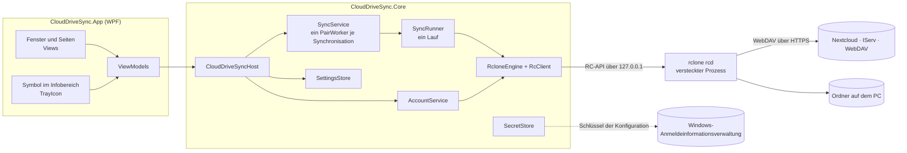
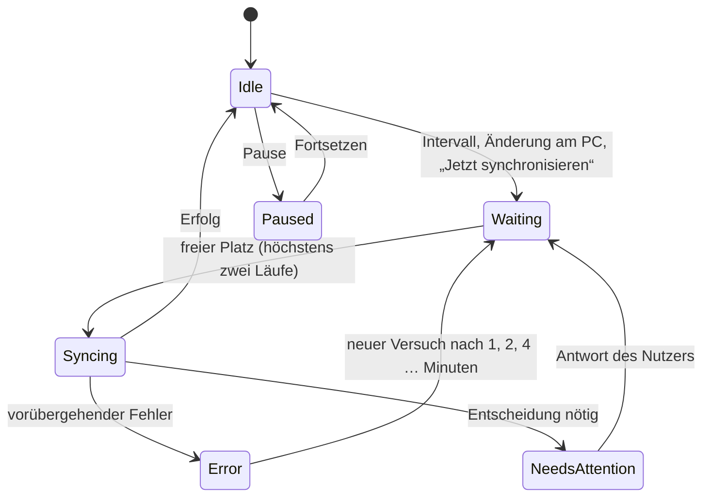
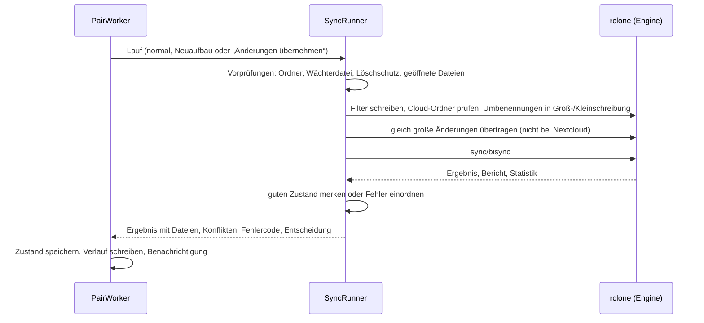

# Aufbau von CloudDrive-Sync

*English version: [ARCHITECTURE.en.md](ARCHITECTURE.en.md)*

Dieses Dokument erklärt, wie CloudDrive-Sync aufgebaut ist und warum: die Bausteine, den Weg einer Synchronisation,
die Schutzmechanismen und die Eigenheiten von rclone und den Servern, die man kennen muss. Wie man das Projekt baut,
testet und veröffentlicht, steht im [Entwickler-Handbuch](DEVELOPMENT.md), die Regeln für neuen Code in
[CONTRIBUTING.md](../CONTRIBUTING.md).

## Überblick

CloudDrive-Sync hält Ordner auf einem Windows-PC mit Nextcloud, IServ und anderen WebDAV-Speichern in beide Richtungen
aktuell. Die eigentliche Arbeit mit den Servern erledigt [rclone](https://rclone.org) – genauer `rclone bisync` – in
einem versteckten Hintergrundprozess. CloudDrive-Sync steuert ihn, legt ein Sicherheitsnetz um ihn und zeigt alles in
einer Windows-11-Oberfläche.

## Projekte und Ordner

| Ordner | Inhalt |
|---|---|
| `src/CloudDriveSync.Core` | Die ganze Fachlogik: Konten, Engine, Synchronisation, Einstellungen, Fehler. Kennt keine Oberfläche. |
| `src/CloudDriveSync.App` | Die WPF-Oberfläche (MVVM): Fenster, Seiten, Symbol im Infobereich, Updates. |
| `tests/CloudDriveSync.Core.Tests` | Unit-Tests ohne Netz und ohne rclone (xUnit). |
| `tests/CloudDriveSync.Core.IntegrationTests` | Echtes rclone gegen einen lokalen WebDAV-Testserver: Dateivorgänge, Schutzmechanismen, Dienst. |
| `tools/` | Release (`New-Release.ps1`), Programmsymbol (`New-AppIcon.ps1`), Kodierung der Quelldateien (`Format-SourceFiles.ps1`). |

**Abhängigkeiten zeigen nur in eine Richtung:** App → Core. Der Core benutzt kein WPF; die Tests setzen ihn genauso
zusammen wie das Programm, über `CloudDriveSyncHost`.

Ordner im Core:

| Ordner | Aufgabe |
|---|---|
| `Accounts` | Konten verbinden und prüfen, Nextcloud-Anmeldung im Browser, WebDAV-Adressen, Ordnernamen von IServ. |
| `Engine` | rclone bereitstellen (`RcloneInstaller`), starten und beenden (`RcloneEngine`), seine RC-API (`RcClient`). |
| `Sync` | Synchronisationen verwalten (`SyncService`), einen Lauf ausführen (`SyncRunner`) und alle Schutzbausteine. |
| `Settings` | Datenmodell (`AppSettings`) und das sichere Speichern als JSON (`SettingsStore`). |
| `Security` | Der Schlüssel der rclone-Konfiguration in der Windows-Anmeldeinformationsverwaltung (`SecretStore`). |
| `Errors` | Fehlercodes `CD-xxxx` mit Titel und Lösung auf Deutsch und Englisch (`ErrorCatalog`). |
| `Diagnostics` | Das Protokoll (`Log`), Geheimnisse werden vor dem Schreiben geschwärzt. |

Ordner der App: `Infrastructure` (Windows-Anbindung: Symbol im Infobereich, Autostart, Updates, eine Instanz pro
Benutzer …), `ViewModels`, `Views` mit `Views/Pages` (je Seite des Hauptfensters eine Datei), `Themes/Styles.xaml`
(gemeinsame Stile), `Assets` (Programmsymbol).

## Der Start

1. `Program.Main` lässt zuerst [Velopack](https://velopack.io) zu Wort kommen: Beim Installieren, Aktualisieren und
   Deinstallieren startet Velopack das Programm kurz mit eigenen Argumenten und beendet es wieder.
2. `App.OnStartup` sorgt dafür, dass pro Benutzer und Datenordner nur ein CloudDrive-Sync läuft (`SingleInstance`): Ein
   zweiter Start bittet den ersten, sein Fenster zu zeigen, und endet.
3. Das installierte Programm trägt sich unter „App Paths“ ein (`AppRegistration`), damit CloudDrives es findet.
4. `CloudDriveSyncHost` setzt alles zusammen: Pfade, Protokoll, Einstellungen, Geheimnisse, Engine, Konten,
   Synchronisationen.
5. Oberfläche: `MainViewModel`, Symbol im Infobereich, Hauptfenster. Mit `--background` (Start mit Windows) bleibt das
   Fenster zu.
6. `StartAsync` startet die Engine und danach jede Synchronisation.

Schließt man das Fenster, wird es nur versteckt; CloudDrive-Sync synchronisiert im Infobereich weiter. Erst „Beenden“
hält alle Synchronisationen sauber an und beendet die Engine.

## Datenordner

Alles liegt unter einem Ordner, standardmäßig `%LOCALAPPDATA%\CloudDrive-Sync` – getrennt von CloudDrives. Die
Umgebungsvariable `CLOUDDRIVE_SYNC_HOME` wählt einen anderen (Tests, tragbare Kopie). Das installierte Programm selbst
liegt woanders: `%LOCALAPPDATA%\CloudDriveSync\current` (Velopack).

| Pfad | Inhalt |
|---|---|
| `settings.json` (+ `.bak`) | Konten, Synchronisationen, Einstellungen – **nie ein Geheimnis**. Gespeichert wird über eine temporäre Datei mit Sicherung; ist die Datei beschädigt, nimmt `SettingsStore` die Sicherung. |
| `rclone.conf` | Die rclone-Konfiguration mit den Zugängen. **Immer verschlüsselt** (`RCLONE_ENCRYPT_V0:`). |
| `logs\` | `clouddrive-sync-<Datum>.log` (14 Tage), `rclone.log` (10 MB × 5). |
| `deps\rclone\1.75.1\` | `rclone.exe` in der festgelegten Version. |
| `cache\` | Zwischenspeicher von rclone. |
| `sync\<id>\` | Zustand einer Synchronisation, siehe unten. |

Im synchronisierten Ordner selbst legt CloudDrive-Sync nur zwei versteckte Dinge an: die **Wächterdatei**
`.clouddrive-sync` und den **Papierkorb** `.clouddrive-papierkorb\<Datum Uhrzeit>\`.

## Sicherheit der Zugangsdaten

- Zugangsdaten werden nur beim Verbinden eingegeben. Das Passwort (bei Nextcloud ein eigenes App-Passwort aus der
  Anmeldung im Browser) bleibt nur im Speicher, bis rclone es übernimmt.
- rclone hält es in `rclone.conf`, die immer verschlüsselt ist. Der Schlüssel liegt in der
  Windows-Anmeldeinformationsverwaltung (`SecretStore`), geschützt durch DPAPI für den angemeldeten Benutzer.
- `settings.json`, das Protokoll und die Berichte enthalten keine Geheimnisse; `Log.Redact` schwärzt Passwörter,
  Tokens und `Bearer`-Angaben vor dem Schreiben.
- Ein anderer Datenordner bekommt eigene Einträge in der Anmeldeinformationsverwaltung (`AppPaths.SecretPrefix`), damit
  Tests nie die Schlüssel der echten Installation berühren.
- „Neu anmelden“ prüft die neue Anmeldung zuerst an einem vorübergehenden Remote (`cd-signin-<id>`); erst wenn der Server
  sie annimmt, ersetzt sie die alte.

## Die Engine

`RcloneEngine` startet genau einen versteckten Prozess `rclone rcd` und spricht mit ihm über die RC-API (`RcClient`):

- nur auf `127.0.0.1`, mit zufälligem Port und zufälligen Zugangsdaten bei jedem Start (als Umgebungsvariablen, nie auf
  der Befehlszeile),
- mit der verschlüsselten Konfiguration (`RCLONE_CONFIG_PASS` aus der Anmeldeinformationsverwaltung),
- in einem Windows-Job-Objekt: Endet CloudDrive-Sync – auch durch einen Absturz –, endet die Engine mit.

`RcloneInstaller` stellt rclone in der festgelegten Version 1.75.1 bereit: aus dem Datenordner, aus
`CLOUDDRIVE_SYNC_RCLONE` (Entwicklung, Tests) oder als Download von rclone.org bzw. GitHub – **nur angenommen, wenn die
SHA256-Prüfsumme stimmt**.

Jedes Konto ist in rclone ein Remote namens `cd-<id>` (Typ WebDAV, mit Hersteller Nextcloud oder Other).

## Eine Synchronisation

Eine Synchronisation (`SyncPairSettings`) verbindet einen Cloud-Ordner (`RemotePath`, leer = ganzes Konto) mit einem
Ordner auf dem PC (`LocalPath`). Dazu gehören die Auswahl (alles oder nur gewählte Ordner und Dateien), die
Konfliktregel, das Intervall, die Löschgrenze, `CloudCheckFile` (ob die Wächterdatei auch in der Cloud liegt) und
`LocalOnly` (Dateien, die der Server nicht angenommen hat). In rclones Sprache ist die Cloud **Path1**, der PC **Path2**.

Ihr Zustand liegt in `sync\<id>\`:

| Datei | Wofür |
|---|---|
| `filter.txt`, `filter.txt.md5`, `filter-base.txt` | Die Auswahl als rclone-Filter (`SyncFilters`); die Prüfsumme gehört bisync, die Basisdatei unterscheidet echte Auswahländerungen von „nur am PC“-Dateien. |
| `bisync\` | Arbeitsordner von bisync: die Listen beider Seiten nach dem letzten Lauf. |
| `last-good\` | Kopie dieser Listen nach dem letzten guten Lauf (`RunSafety`). |
| `local-files.txt` | Jede Datei am PC mit Größe und Zeit nach dem letzten Lauf (`DeleteGuard`). |
| `server-times.json` | Größe und Serverzeit jeder Datei beider Seiten (`QuietServerChanges`). |
| `state.json` | Was einen Neustart überdauert: erster Abgleich erledigt, letzter Lauf, offener Fehler, offene Entscheidung. |
| `runs.jsonl` | Die letzten Läufe mit den Dateien, die sie geändert haben (`RunHistory`, für „Aktivität“). |
| `last-run.txt` | Der geschwärzte Bericht von bisync zum letzten Lauf, zur Fehlersuche. |

### Wer wann einen Lauf auslöst

`SyncService` verwaltet alle Synchronisationen: hinzufügen (mit Wächterdateien), entfernen (Dateien bleiben auf beiden
Seiten), pausieren, Einstellungen ändern, Entscheidungen beantworten, „Abgleich überprüfen“. Jede Synchronisation hat
einen eigenen **`PairWorker`** (`SyncService.PairWorker.cs`):

- Ein **Intervall-Timer** holt Änderungen aus der Cloud (Standard: alle 5 Minuten).
- Ein **Ordnerwächter** (`FileSystemWatcher`) bemerkt Änderungen am PC; nach 5 Sekunden Ruhe startet ein Lauf.
  Temporäre Dateien von Office und LibreOffice zählen nicht.
- **Wiederholungen:** Eine geöffnete Datei wird jede Minute neu versucht, Netz- oder Serverprobleme nach 1, 2, 4 …
  Minuten, höchstens im Intervall.
- Anfragen, die während eines Laufs kommen, werden zusammengefasst; die stärkste gewinnt (Neuaufbau vor „Änderungen
  übernehmen“ vor normalem Lauf).
- Höchstens **zwei Läufe gleichzeitig** über alle Synchronisationen. „Abgleich überprüfen“ wartet, bis ein laufender
  Abgleich derselben Synchronisation fertig ist.
- Braucht eine Synchronisation eine **Entscheidung** (zu viele Löschungen, Neuaufbau, Anmeldung, fehlender Ordner),
  laufen keine automatischen Läufe mehr, bis der Nutzer antwortet.

### Ein Lauf

`SyncRunner` führt einen Lauf aus. Die Reihenfolge ist Absicht: Erst wird geprüft, ob überhaupt sicher abgeglichen
werden kann, dann gleicht rclone ab, dann wird das Ergebnis ausgewertet.

1. **Vorprüfungen** – ohne Netz, vor jeder Änderung:
   - Fehlt der Ordner am PC (z. B. USB-Stick abgezogen), läuft nichts: Ein leerer Ordner wird nie als „alles gelöscht“
     verstanden (`CD-4501`).
   - Fehlt die Wächterdatei, hält die Synchronisation an (`CD-4503`).
   - **Löschschutz** (`DeleteGuard`): Fehlen am PC mehr Dateien als erlaubt, hält sie an, bevor in der Cloud etwas
     gelöscht wird (`CD-4502`).
   - Ist eine geänderte Datei in einem anderen Programm exklusiv geöffnet, wartet der Lauf (`CD-4510`), statt dass rclone
     den ganzen Lauf aufgibt.
2. **Vorbereitung:** Filterdatei schreiben. Ohne Wächterdatei in der Cloud prüft `CloudFolderCheck`, ob der Cloud-Ordner
   da ist und nicht plötzlich leer aussieht (`CD-4512`). `CaseRenames` überträgt Umbenennungen, die nur Groß- und
   Kleinschreibung ändern.
3. **Gleich große Änderungen** (`QuietServerChanges`, nicht bei Nextcloud): Server ohne eigene Änderungszeiten melden
   eine Änderung, die die Größe nicht ändert, nicht. CloudDrive-Sync merkt sich deshalb Größe und Serverzeit jeder Datei
   und überträgt solche Änderungen selbst – in beide Richtungen, bei Änderungen auf beiden Seiten als Konfliktkopie.
4. **bisync** mit den Einstellungen aus `BisyncCommand` (siehe unten).
5. **Auswertung:**
   - Erfolg: Löschschutz-Liste, Serverzeiten und guter Zustand (`last-good`) werden gemerkt; `RunChanges` liest aus dem
     Bericht, welche Datei wohin ging. `PcListingTimes` setzt in bisyncs Liste der PC-Seite die echten Dateizeiten ein,
     wo bisync die Zeit des Servers notiert hat (siehe Eigenheiten).
   - Lehnt der Server einzelne Dateien ab (z. B. ein Ordner nur zum Lesen), bleiben sie am PC und aus dem Abgleich
     heraus (`LocalOnly`); der Lauf wird ohne sie wiederholt – ohne Neuaufbau.
   - Namen, die sich nur in Groß-/Kleinschreibung unterscheiden: Der PC übernimmt die Schreibweise des Servers, der Lauf
     wird einmal wiederholt.
   - Bricht ein Lauf an etwas Vorübergehendem ab (Datei geöffnet, Netz weg), stellt `RunSafety` den letzten guten
     Zustand wieder her und der nächste Versuch kommt bald – ohne Neuaufbau.
   - Alles andere ordnet `ErrorCatalog.Classify` einem Fehlercode zu; manche Codes verlangen eine Entscheidung.

### Die Einstellungen für bisync

| Einstellung | Warum |
|---|---|
| `checkAccess` + `checkFilename .clouddrive-sync` | Wächterdatei auf beiden Seiten: Ist ein Ordner weg oder verschoben, hält bisync an, statt alles zu löschen. |
| `maxDelete` = Löschgrenze der Synchronisation | Mehr Löschungen als erlaubt halten den Lauf an (zusätzlich zu `DeleteGuard`). |
| `compare = size,modtime,checksum`, `slowHashSyncOnly` | Jede Seite vergleicht mit dem, was sie kann; Prüfsummen am PC nur, wo nötig. |
| `conflictResolve`, `conflictLoser = num`, `conflictSuffix` | Konflikte nach der gewählten Regel; die andere Fassung bleibt als `Name.Konflikt-PC1.docx` bzw. `Konflikt-Cloud1` erhalten. |
| `recover`, `resilient`, `maxLock = 30m` | Nach einer Unterbrechung sauber weitermachen; leichtere Fehler beim nächsten Lauf wiederholen. |
| `backupDir2` | Was der Abgleich am PC löscht oder ersetzt, kommt in den Papierkorb am PC. |
| `TrackRenames`, `SuffixKeepExtension` | Umbenannte Dateien werden nicht neu hochgeladen; Konfliktkopien behalten ihre Endung. |
| `resync` + `resyncMode = newer` (nur erster Abgleich und Neuaufbau) | Beide Seiten zusammenführen, **nichts löschen**. |
| `force` (nur nach Bestätigung) | Löschungen über der Grenze übernehmen, wenn der Nutzer das ausdrücklich will. |

## Wichtige Entscheidungen

- **rclone bisync statt einer eigenen Sync-Engine.** bisync ist erprobt, kennt WebDAV, Nextcloud und viele andere
  Speicher und arbeitet nachvollziehbar mit Listen beider Seiten. CloudDrive-Sync legt ein eigenes Sicherheitsnetz darum,
  statt den Abgleich neu zu erfinden. Für „Dateien bei Bedarf“ (Version 0.3, Windows Cloud Files API) ist ein eigener
  Kern geplant.
- **Ein eigener Löschschutz in Dateien.** rclones Grenze zählt Ordner mit; in kleinen Ordnerbäumen schlägt sie zu spät
  oder zu früh an. `DeleteGuard` zählt Dateien, so wie Menschen „mehr als die Hälfte“ lesen.
- **Wächterdatei auf beiden Seiten** – und wo der Server keine Datei annimmt (IServ: „Gruppen“ selbst, das ganze Konto,
  Ordner nur zum Lesen), prüft `CloudFolderCheck` den Cloud-Ordner vor jedem Lauf selbst.
- **Eigene Serverzeiten** (`QuietServerChanges`) für Server ohne verlässliche Änderungszeiten, damit gleich große
  Änderungen nicht verloren gehen.
- **Der letzte gute Zustand** (`RunSafety`): Vorübergehende Probleme kosten keinen Neuaufbau mehr.
- **Abgelehnte Dateien bleiben am PC** (`LocalOnly`) statt einen Neuaufbau zu erzwingen; die Prüfsumme der Filterdatei
  wird dafür gezielt erneuert.
- **Papierkorb nur am PC.** Ein Papierkorb-Ordner in der Cloud wäre auf dem Server sichtbar – in geteilten Ordnern für
  alle. Was am PC gelöscht wird, liegt ohnehin im Papierkorb von Windows; Nextcloud hat einen eigenen.
- **Geheimnisse nur verschlüsselt** in der rclone-Konfiguration, Schlüssel in der Windows-Anmeldeinformationsverwaltung,
  nie in Einstellungen, Protokollen oder diesem Repository.
- **Eine Engine** auf `127.0.0.1` mit Zufallsport und Zufallszugang, an CloudDrive-Sync gebunden (Job-Objekt).
- **Velopack** für Installation und Updates: pro Benutzer ohne Administratorrechte, .NET enthalten, Updates nur aus dem
  GitHub-Projekt und mit Prüfsumme.
- **Getrennt von CloudDrives:** eigener Datenordner, eigene Schlüssel, eigenes Programm. Beide öffnen einander über
  ihr Symbol im Infobereich, hängen aber nicht voneinander ab.

## Eigenheiten von rclone und den Servern

- **Filteränderungen:** bisync merkt sich die Prüfsumme der Filterdatei (`filter.txt.md5`) und verlangt nach jeder
  Änderung einen Neuaufbau. Eine geänderte Auswahl löst deshalb bewusst einen Neuaufbau aus. Nur wenn sich allein die
  „nur am PC“-Dateien ändern, erneuert `SyncFilters.Write` die Prüfsumme selbst – erkennbar an `filter-base.txt`.
- **Zeiten der PC-Seite:** Liegt eine Datei auf beiden Seiten gleich groß und ist die Zeit des Servers neuer, notiert
  bisync diese Zeit auch für den PC – ohne sie zu übertragen, denn IServ lässt keine Zeiten setzen und rclone vergleicht
  dort nur Größen. Beim nächsten Lauf sähe die PC-Datei „älter“ aus: bisync lüde sie erneut hoch, womöglich über eine
  neuere Fassung auf dem Server, und hielte mit „all files were changed“ an, wenn das alle Dateien betrifft – auch die
  Wächterdatei, die der Server einen Moment nach dem PC bekommt. Das geschieht nach dem ersten Abgleich eines Ordners,
  dessen Dateien schon auf beiden Seiten lagen. `PcListingTimes` korrigiert solche Einträge nach jedem erfolgreichen
  Lauf: nur Einträge mit der Serverzeit, der Größe der Datei und einer Zeit, die neuer ist als die Datei – eine Änderung
  am PC macht eine Datei neuer, nie älter.
- **„must resync“:** Nach manchen Fehlern verlangt bisync einen Neuaufbau. Mit `last-good` und `resilient`/`recover`
  kommt CloudDrive-Sync bei vorübergehenden Fehlern ohne ihn aus.
- **Der Bericht von bisync** ist die einzige Quelle dafür, welche Datei wohin ging (`RunChanges`): `Queue copy to Path1`
  (hochgeladen), `Queue copy to Path2` (geholt), `Queue delete`, beim Neuaufbau `Resync is copying files to`.
- **IServ** speichert keine eigenen Änderungszeiten (rclone vergleicht dort nur Größen) und nimmt in seiner Wurzel und
  in „Groups“ selbst keine Dateien an (Antwort 500). Seine Ordner heißen im WebDAV `Files` und `Groups`, auf den
  Webseiten „Eigene Dateien“ und „Gruppen“ – CloudDrive-Sync zeigt die bekannten Namen (`CloudFolderNames`).
- **Nextcloud** hat Änderungszeiten und Prüfsummen und antwortet auf abgelehnte Schreibzugriffe mit 403. `rclone serve
  webdav` kann Nextcloud nicht nachbilden; dafür braucht es einen echten Testzugang.
- **Groß- und Kleinschreibung:** Windows hält `Bericht.docx` und `bericht.docx` für dieselbe Datei, die Server für zwei.
  bisync stoppt dann mit „out of sync“; `CaseRenames` gleicht die Schreibweisen vorher an.
- **rclones Löschgrenze** zählt Ordner mit (siehe oben).

## Fehlercodes

Jeder Fehler hat einen Code `CD-xxxx` mit Titel und Lösung auf Deutsch und Englisch (`ErrorCatalog`). Die Nummern
folgen derselben Einteilung wie in CloudDrives:

| Bereich | Thema |
|---|---|
| `CD-1xxx` | Downloads und Prüfsummen (z. B. rclone) |
| `CD-2xxx` | Einstellungen, Konfiguration, Schlüssel |
| `CD-3xxx` | Anmeldung und Server |
| `CD-45xx` | Synchronisation (Ordner, Löschschutz, Neuaufbau, geöffnete Dateien …) |
| `CD-5xxx` | Verbindung und Engine |
| `CD-9000` | Unerwarteter Fehler |

`ErrorCatalog.Classify` erkennt Codes an Mustern in den Antworten von rclone und den Servern. Ob ein Code eine
Entscheidung verlangt, legt `SyncRunner` fest (`SyncDecision`).

## Die Oberfläche

- **MVVM** mit dem [CommunityToolkit.Mvvm](https://learn.microsoft.com/dotnet/communitytoolkit/mvvm/): Eigenschaften mit
  `[ObservableProperty]`, Befehle mit `[RelayCommand]`. Die Views enthalten keine Fachlogik, nur Fensterverhalten
  (z. B. den Dialog zur Ordnerauswahl).
- `MainViewModel` hält die Seiten (`Page`), die Karten der Synchronisationen (`SyncPairViewModel`) und Konten
  (`AccountViewModel`), die Aktivität und die Updates. Jede Seite des Hauptfensters liegt in `Views/Pages`.
- **Threads:** `SyncService` meldet Änderungen auf beliebigen Threads; `MainViewModel` reicht sie an den Fenster-Thread
  weiter (`OnWindowThread`).
- **Dialoge** laufen über `IDialogs`/`DialogService`, damit ViewModels keine Fenster kennen.
- **Symbol im Infobereich** (`TrayIcon`): Statuspunkt, Menü, Benachrichtigungen.
- **Updates:** `UpdatesViewModel` mit `Updater` (Velopack, GitHub-Releases; Testversionen sind Pre-Releases).
- **Barrierefreiheit:** Bedienelemente tragen `AutomationProperties.Name`; Listen mit Karten nutzen `CardList`, damit
  Bildschirmleser ihre Einträge finden.
- **Texte der Oberfläche** sind deutsch und stehen direkt in XAML und ViewModels.
- **Bilder der eigenen Fenster** für Tests: `CLOUDDRIVE_SYNC_SNAPSHOTS=<Ordner>` (`WindowSnapshots`).

## Protokolle und Fehlersuche

- `logs\clouddrive-sync-<Datum>.log`: was CloudDrive-Sync tut (Zeit, Stufe, Baustein, Text), geschwärzt.
- `logs\rclone.log`: das Protokoll der Engine.
- `sync\<id>\last-run.txt`: der Bericht von bisync zum letzten Lauf.
- „Abgleich überprüfen“ in der Oberfläche vergleicht jede Datei beider Seiten, ohne etwas zu ändern (`SyncVerifier`).
